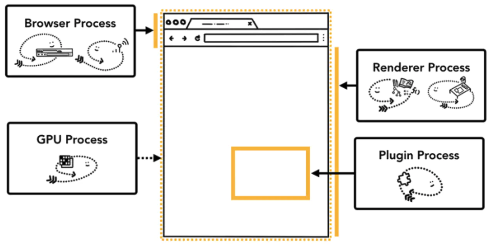

# Browser Processes and Threads

## 1. Process vs Thread

A `Process` is a minimum unit of resource allocation in an operating system

A `Thread` is a minimum unit of independent dispatch, it belongs to a `Process`

1 `Process` can create multiple `Threads` while a `Thread` can only belong to 1 `Process`

### Process

* ready: waiting to be dispatched by the scheduler

* running

* waiting: waiting for `some resources` to be released

  

## 2. Multiple Process Architecture

Every tab in Chrome has an individual process, that says, every tab has an individual rendering engine instance.

- **Browser Process** 浏览器的主进程（负责协调、主控） （1）负责包括地址栏，书签栏，前进后退按钮等部分的工作 （2）负责处理浏览器的一些不可见的底层操作，比如网络请求和文件访问 （3）负责各个页面的管理，创建和销毁其他进程
- **Renderer Process** 负责一个 tab 内关于网页呈现的所有事情，页面渲染，脚本执行，事件处理等
- **Plugin Process** 负责控制一个网页用到的所有插件，如 flash 每种类型的插件对应一个进程，仅当使用该插件时才创建
- **GPU Process** 负责处理 GPU 相关的任务
- **Network Process **主要负责页面的网络资源加载，之前是作为一个模块运行在浏览器进程里面的，直至最近才独立出来，成为一个单独的进程。

## 3. Pros and Cons

**优点：** （1）某一渲染进程出问题不会影响其他进程 （2）更为安全，在系统层面上限定了不同进程的权限

**缺点：** （1）由于不同进程间的内存不共享，不同进程的内存常常需要包含相同的内容。**为了节省内存，Chrome 限制了最多的进程数，最大进程数量由设备的内存和 CPU 能力决定，当达到这一限制时，新打开的 Tab 会共用之前同一个站点的渲染进程。**

Chrome 把浏览器不同程序的功能看做服务，这些服务可以方便的分割为不同的进程或者合并为一个进程。

以 Browser Process 为例，如果 Chrome 运行在强大的硬件上，它会分割不同的服务到不同的进程，这样 Chrome 整体的运行会更加稳定，但是如果 Chrome 运行在资源贫瘠的设备上，这些服务又会合并到同一个进程中运行，这样可以节省内存。

##4. Multiple Threading

When we talk about multi-threading in browsers, we often refer to the multi-threading in `Renderer Process`.

#### 1. GUI Rendering Thread

Takes care of rendering DOM elements. When our webpage requires `repaint` or `reflow`, this thread will run. When `JavaScript Engine Thread` is running, `GUI Rendering Thread` is freezed.

#### 2. JavaScript Engine Thread

JS内核，负责处理Javascript脚本程序。 一直等待着任务队列中任务的到来，然后解析Javascript脚本，运行代码。一个Tab页（Renderer进程）中无论什么时候都只有一个JS线程在运行JS程序。

**ps：** GUI渲染线程与JS引擎线程是互斥的，所以如果JS执行的时间过长，这样就会造成页面的渲染不连贯，导致页面渲染加载阻塞。

#### 3. Timer Thread

- 定时器setInterval与setTimeout所在线程
- 浏览器定时计数器并不是由JavaScript引擎计数的 因为JavaScript引擎是单线程的, 如果处于阻塞线程状态就会影响记计时的准确, 因此通过单独线程来计时并触发定时是更为合理的方案。

#### 4. Event Trigger Thread

* 用来控制事件轮询，JS引擎自己忙不过来，需要浏览器另开线程协助
* 当JS引擎执行代码块如鼠标点击、AJAX异步请求等，会将对应任务添加到事件触发线程中
* 当对应的事件符合触发条件被触发时，该线程会把事件添加到待处理任务队列的队尾，等待JS引擎的处理
* 由于JS的单线程关系，所以这些待处理队列中的事件都得排队等待JS引擎处理（当JS引擎空闲时才会去执行）

#### 5. Asynchronous HTTP Requesting Thread

在XMLHttpRequest在连接后是通过浏览器新开一个线程请求， 将检测到状态变更时，如果设置有回调函数，异步线程就产生状态变更事件放到 JavaScript引擎的处理队列中等待处理。

## 5. IPC (Inter Process Communication)

### 消息队列

相比于 FIFO，消息队列具有以下优点：

- 消息队列可以独立于读写进程存在，从而避免了 FIFO 中同步管道的打开和关闭时可能产生的困难；
- 避免了 FIFO 的同步阻塞问题，不需要进程自己提供同步方法；
- 读进程可以根据消息类型有选择地接收消息，而不像 FIFO 那样只能默认地接收。

### Storage Sharing

允许多个进程共享一个给定的存储区。因为数据不需要在进程之间复制，所以这是最快的一种 IPC。

需要使用信号量用来同步对共享存储的访问。

多个进程可以将同一个文件映射到它们的地址空间从而实现共享内存。另外 XSI 共享内存不是使用文件，而是使用内存的匿名段。

### Socket

与其它通信机制不同的是，它可用于不同机器间的进程通信。

### Reference

Browser Thread and Process: https://juejin.im/post/5ca49fea6fb9a05e731fc03d

IPC: https://github.com/CyC2018/CS-Notes/blob/master/notes/%E8%AE%A1%E7%AE%97%E6%9C%BA%E6%93%8D%E4%BD%9C%E7%B3%BB%E7%BB%9F%20-%20%E8%BF%9B%E7%A8%8B%E7%AE%A1%E7%90%86.md

