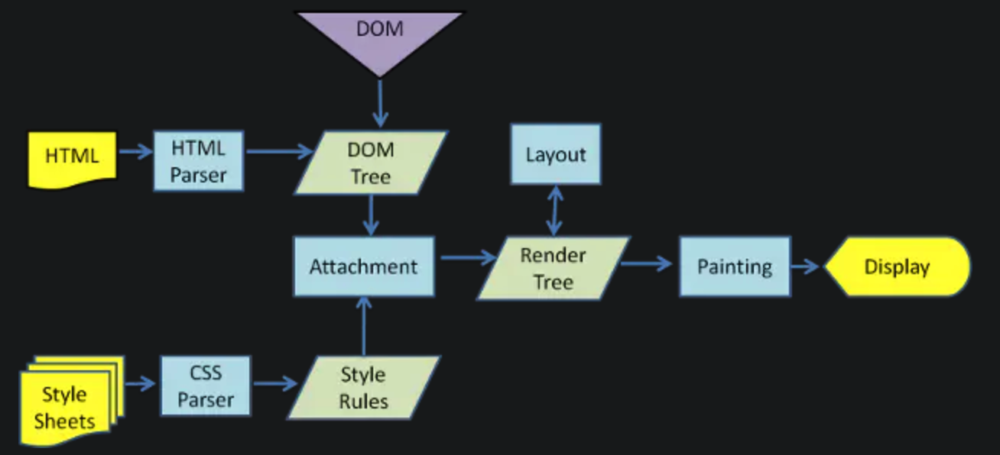

# Relayout (Reflow) and Repaint

## What did browser do to convert static assets to a beautiful webpage?



1. Do 2 things in parallel:
   * parse HTML, generate `DOM Tree`
   * parse css, generate `CSSOM Tree`
2. Merge `DOM Tree` and `CSSOM Tree` to generate `Render Tree`
3. Layout according to `Render Tree`, get element geometry (location, size...)
4. Paint according to `Render Tree` and Layout, get element pixel information
5. Display elements on browser with the help of GPU

## Step 1: Parse `HTML` and `CSS `

Will parsing `CSS` file block the process of parsing `HTML`?

​	No, these 2 processes are parallel.

Will parsing `CSS` file block the process of rendering `DOM Tree`?

​	Yes, because rendering is dependent on `CSSOM Tree`

Will parsing `CSS` file block the `js` files?

​	Yes, because execution of js might visit CSS properties

## Step 2: Merge `DOM Tree` and `CSSOM Tree` to generate `Render Tree`


What are invisible in terms of `Render Tree`?

* `<script>` , `<meta>`, `<link>`
* `display: none`

## Step 3: Layout

Traversal from the root node of the `Render Tree` to compute each element's location and size inside the viewport

## Step 4: Paint

Convert elements into pixels on the screen according to their locations and sizes

## Optimization

### When is Layout triggered?

* add / remove visible DOM elements (in terms of `Render Tree`)
* element position changed
* element size changed
* element content changed
* page started rendering
* browser window size changed

### Note:

Modern browsers will store relayout operations in a queue until it reaches a certain threshold or a certain time has passed

But if we manually visit the layout information of elements, it will clean up the queue and apply all layouts at once

* offsetTop, offsetLeft, offsetWidth, offsetHeight
* scrollTop, scrollLeft, scrollWidth, scrollHeight
* clientTop, clientLeft, clientWidth, clientHeight
* getComputedStyle()
* getBoundingClientRect

### How to minimize `Relayout` and `Repaint`?

* merge multiple updates of styling

  * modify the `class` of an element

* detour update

  * make the element out of the `Render Tree`

    3 ways:

    1. hide element (`display: none`)
    2. construct a sub tree outside dom flow with `<DocumentFragment>`
    3. clone the element outside the dom flow

  * modify the element multiple times

  * put the element back to the dom flow

* avoid applying relayouts in queue manually

* completely remove element from dom flow

  * for complex animations
  * use `position: absolute`

```JavaScript
// 1. hide element
function appendDataToElement(appendToElement, data) {
    let li;
    for (let i = 0; i < data.length; i++) {
    	li = document.createElement('li');
        li.textContent = 'text';
        appendToElement.appendChild(li);
    }
}
const ul = document.getElementById('list');
ul.style.display = 'none'; // 1st relayout
appendDataToElement(ul, data);
ul.style.display = 'block';// 2nd relayout

// 2. construct a sub tree outside dom flow
const ul = document.getElementById('list');
const fragment = document.createDocumentFragment();
appendDataToElement(fragment, data);
ul.appendChild(fragment);	 // 1st relayout

// 3. clone an element outside the dom flow
const ul = document.getElementById('list');
const clone = ul.cloneNode(true);
appendDataToElement(clone, data);
ul.parentNode.replaceChild(clone, ul);
```

### GPU Hardware Boosting

Instead of minimizing the number of relayouts and repaints, we would rather completely remove relayouts and repaints.

How to trigger GPU Boosting so that some relayouts and repaints can be prevented?

* 3d transforms: `translate3d`, `translateZ`
* `transform`
* `opacity`
* `filters`
* `will-change`

Pros:

- The animation is fast and smooth, at 60 frames per second
- A properly crafted animation works in a separate thread and is not blocked by heavy JavaScript calculations
- 3D transforms are “cheap.”

Cons:

* Additional repainting is required to promote an element to a composite layer. Sometimes this is very slow (i.e. when we get a full-layer repaint, instead of an incremental one)
  * sometimes we can set `z-index` of an element which has lots of animation to be extremely high to avoid composite layer ordering
* other properties like `background-color` will still cause relayout and repaint, but their performance can be revamped
* if too many elements are taking use of GPU boosting, RAM shall be eaten up quickly
* rendering font with GPU will disable `anti-aliasing`

### Reference

Re-Layout and Re-Paint: https://juejin.im/post/5c0f104551882509a7683d63

Blocking: https://juejin.im/post/5b88ddca6fb9a019c7717096

Fragment: https://developer.mozilla.org/en-US/docs/Web/API/DocumentFragment

GPU Boosting: https://www.smashingmagazine.com/2016/12/gpu-animation-doing-it-right/