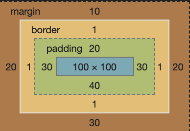
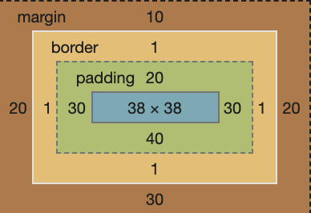

# Box Model

[Codepen](https://codepen.io/frostace/pen/QWyaMRX)

## Content Box

```css
.box {
    background-color: red;
    border: solid 1px black;
    width: 100px;
    height: 100px;
    padding: 20px 30px 40px;
    margin: 10px 20px 30px;
}
```



## Border Box

```css
.box {
    box-sizing: border-box;
    border: solid 1px black;
    background-color: yellow;
    width: 100px;
    height: 100px;
    padding: 20px 30px 40px;
    margin: 10px 20px 30px;
}
```



