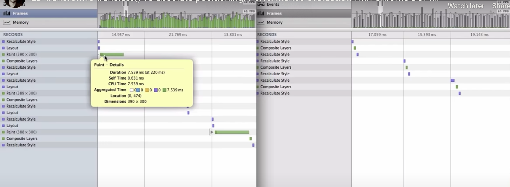

# CSS Position Property

|position | comment |
|---|---|
|static (default) |Not affected by tblr (top, bottom, left, right) properties / values|
|relative |tblr values cause element to be moved from its normal position|
|absolute |positioned relative to its parent element that is positioned "relative"|
|fixed |positioned relative to the viewport|
|sticky |positioned based on scroll position|

### <strong>potision: absolute + left: 50%</strong> v.s. <strong>transform: translateX(50%)</strong>

1. position method would make the element fit into the closest pixel at every frame, while translate method would make the whole animation smooth by adding interpolations within pixels

[CodePen Demo](https://codepen.io/frostace/pen/XWmwLeQ)

2. position method would lead to page re-paint on CPU, which takes longer time, while translate method is executed on GPU

### Reference

https://www.paulirish.com/2012/why-moving-elements-with-translate-is-better-than-posabs-topleft/
