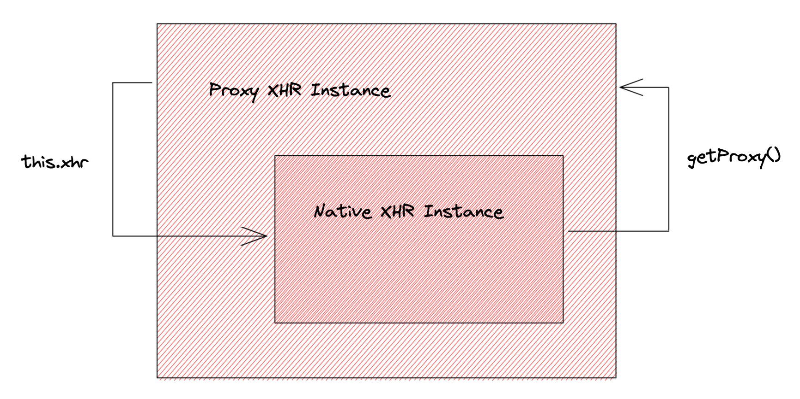

# 代理模式


# 最佳实践

## Ajax-hook 拦截器

### 核心API

#### `hook(Hooks)`

拦截全局`XMLHttpRequest`，此方法调用后，浏览器原生的`XMLHttpRequest`将会被代理，代理对象会覆盖浏览器原生`XMLHttpRequest`，直到调用`unHook()`后才会取消代理。

- `hooks`; 钩子对象，里面是XMLHttpRequest对象的回调、方法、属性的钩子函数，钩子函数会在执行`XMLHttpRequest`对象真正的回调、方法、属性访问器前执行。
- 返回值: 浏览器原生的`XMLHttpRequest`.

#### `unHook()`

- 取消拦截；取消后`XMLHttpRequest`将不会再被代理，浏览器原生`XMLHttpRequest`会恢复到全局变量空间。

#### `proxy(proxyObject)`

拦截全局`XMLHttpRequest`。

参数：`proxyObject`是一个对象，包含三个可选的钩子`onRequest`、`onResponse`、`onError`，我们可以直接在这三个钩子中对请求进行预处理。

返回值：浏览器原生的`XMLHttpRequest`

#### `unProxy()`

- 取消拦截；取消后`XMLHttpRequest`将不会再被代理，浏览器原生`XMLHttpRequest`会恢复到全局变量空间。

### 如何使用

1. 基本用法

劫持XMLHttpRequest中的各个方法和回调，在其中插入用户自己注入的回调，并在真正的方法/回调执行前，先执行用户的回调。

也可以劫持属性的读/写操作。

```ts
import {hook} from "ajax-hook"
hook({
  // 拦截回调
  onreadystatechange:function(xhr,event){
    console.log("onreadystatechange called: %O")
    // 返回false表示不阻断，拦截函数执行完后会接着执行真正的xhr.onreadystatechange回调.
    // 返回true则表示阻断，拦截函数执行完后将不会执行xhr.onreadystatechange. 
    return false
  },
  onload:function(xhr,event){
    console.log("onload called")
    return false
  },
  // 拦截方法
  open:function(args,xhr){
    console.log("open called: method:%s,url:%s,async:%s",args)
    // 拦截方法的返回值含义同拦截回调的返回值
    return false
  }
})
```

2. 进一步封装后的用法

暴露3个切点的hook，供用户注入自己的callback来执行。拦截的粒度粗，但使用简单。

```ts
import { proxy, unProxy } from "ajax-hook";
proxy({
    // 请求发起前进入
    onRequest: (config, handler) => {
        console.log(config.url);
        handler.next(config);
    },
    // 请求发生错误时进入，比如超时；注意，不包括http状态码错误，如404仍然会认为请求成功
    onError: (err, handler) => {
        console.log(err.type);
        handler.next(err);
    },
    // 请求成功后进入
    onResponse: (response, handler) => {
        console.log(response.response);
        handler.next(response);
    },
});
```

### 原理解析

#### `hook`核心流程

TODO: 缺个图

- 保存原始XHR构造函数
- 重写XHR构造函数
  - 生成原始XHR函数的一个实例
  - 遍历实例上所有属性
    - hook方法
    - hook属性

```ts
export function hook(proxy) {
    // Avoid double hookAjax
    window[realXhr] = window[realXhr] || XMLHttpRequest;

    XMLHttpRequest = function () {
        var xhr = new window[realXhr]();
        // We shouldn't hookAjax XMLHttpRequest.prototype because we can't
        // guarantee that all attributes are on the prototype。
        // Instead, hooking XMLHttpRequest instance can avoid this problem.
        for (var attr in xhr) {
            var type = typeof xhr[attr];
            
            if (type === "function") {
                // hookAjax methods of xhr, such as `open`、`send` ...
                this[attr] = hookFunction(attr);
            } else {
                // hookAjax attributes, such as `onload`、`onreadystatechange` ...
                Object.defineProperty(this, attr, {
                    get: getterFactory(attr),
                    set: setterFactory(attr),
                    enumerable: true,
                });
            }
        }
        // that = proxied xhr instance
        var that = this;
        xhr.getProxy = function () {
            return that;
        };
      	// xhr = native xhr instance
        this.xhr = xhr;
    };

    // Generate getter for attributes of xhr
    function getterFactory(attr) {
        return function () {
            // ...
        };
    }

    // Generate setter for attributes of xhr; by this we have an opportunity
    // to hookAjax event callbacks （eg: `onload`） of xhr;
    function setterFactory(attr) {
        return function (v) {
            // ...
        };
    }

    // Hook methods of xhr.
    function hookFunction(fun) {
        // ...
    }

    // Return the real XMLHttpRequest
    return window[realXhr];
}
```

1. hook Attribute

```ts
XMLHttpRequest = function () {
    // ...
    Object.defineProperty(this, attr, {
        get: getterFactory(attr),
        set: setterFactory(attr),
        enumerable: true,
    });
};
```

- setterFactory

`event callback attributes`


configEvent


`static attributes`


- getterFactory

low priority

2. hookFunction

Run proxied function first, and run real method after that

```ts
// Hook methods of xhr.
function hookFunction(fun) {
    return function () {
        var args = [].slice.call(arguments);
        if (proxy[fun]) {
            var ret = proxy[fun].call(this, args, this.xhr);
            // If the proxy return value exists, return it directly,
            // otherwise call the function of xhr.
            if (ret) return ret;
        }
        return this.xhr[fun].apply(this.xhr, args);
    };
}
```

- context and arguments

```ts
XMLHttpRequest = function() {
  	// ...
  	if (type === "function") {
        // this refers to proxied xhr instance here
      	// cause it's within the proxied prototype fn
        this[attr] = hookFunction(attr);
    }
}
```

```ts
// Hook methods of xhr.
function hookFunction(fun) {
    return function () {
      	// ...
        // this refers to the proxied xhr instance, too
        // cause hookFunction is directly passing an anonymous fn to an attribute of the proxied xhr instance
      	var ret = proxy[fun].call(this, args, this.xhr);
    };
}
```

In conclusion:

```ts
// this = proxied xhr instance
// this.xhr = native xhr instance
var ret = proxy[fun].call(this, args, this.xhr);
```


3. Why hooking XMLHttpRequest instance instead of XMLHttpRequest prototype?

Because attributes that are enumerable on prototype are definitely enumerable on XHR instance.

Hooking attrs on the instance can guarantee that any attrs on the prototype are hooked.

```ts
['onreadystatechange', 'readyState', 'timeout', 'withCredentials', 'upload', 'responseURL', 'status', 'statusText', 'responseType', 'response', 'responseText', 'responseXML', 'UNSENT', 'OPENED', 'HEADERS_RECEIVED', 'LOADING', 'DONE', 'abort', 'getAllResponseHeaders', 'getResponseHeader', 'open', 'overrideMimeType', 'send', 'setRequestHeader', 'trustTokenOperationError', 'setTrustToken', 'onloadstart', 'onprogress', 'onabort', 'onerror', 'onload', 'ontimeout', 'onloadend', 'addEventListener', 'dispatchEvent', 'removeEventListener']
```

4. Proxied XHR Instance v.s. Native XHR Instance

 - XHR事件回调钩子函数（以"on"开头的），如`onreadystatechange`、`onload`等，他们的拦截函数的第一个参数都为"**原生xhr对象**" (**注意：这个和1.x版本有区别，1.x中为代理xhr对象**)。

```ts

```

 - XHR方法钩子函数（如`open`、`send`等），它们的第二个参数为**原生xhr对象**。


 - 所有回调函数钩子、方法钩子中，`this`为**代理xhr对象**
 - 原生xhr对象和代理对象都有获取彼此的方法和属性，具体见下面示例




# method 2

https://juejin.cn/post/6844903850587979783

# Reference

https://github.com/wendux/Ajax-hook
https://juejin.cn/post/6844903850587979783
