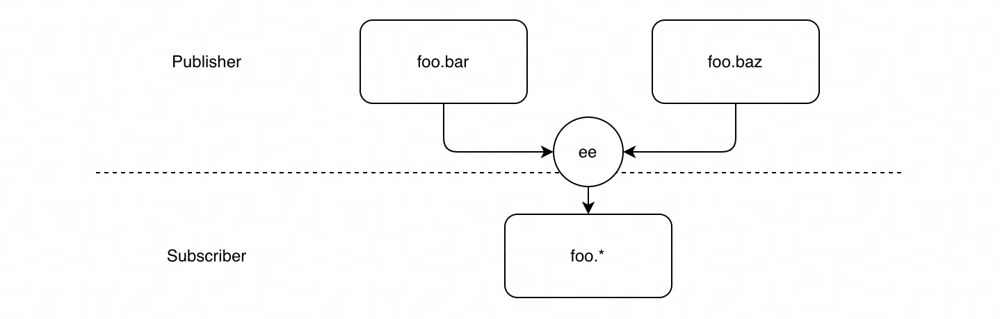
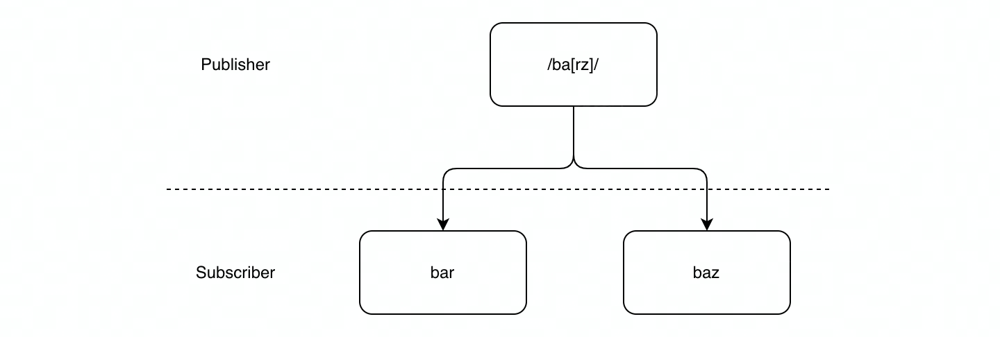

# 本文大纲

-   引言
-   实现
-   最佳实践
-   讨论
-   总结
-   参考资料

## 引言

-   我们从一个现实生活中的例子开始讲起：

    比方说有一天我来到一家小卖部，准备买冰墩墩，老板说，冰墩墩卖完了，现在没货，你下次再来吧。于是过了 2 天，我又来到小卖部，老板依旧告诉我，冰墩墩没货。这时候我和老板都意识到，我们的沟通方式是有问题的。于是我给老板留了我的联系方式，和他约定好，如果冰墩墩到货了，你来告知我一下。我就不用隔三差五来问了，老板也不用总是回答同样的问题。他好，我也好。
    这样的沟通机制，放到我们的程序设计当中，实际上就演变成了发布订阅模式。

-   什么是发布订阅模式？

    "在软件架构中，发布-订阅是一种消息范式，消息的发布者不会将消息直接发送给特定的订阅者。而是将发布的消息分为不同的类别来管理，无需了解哪些订阅者（如果有的话）可能存在。同样的，订阅者可以表达对一个或多个类别的兴趣，只接收感兴趣的消息，无需了解哪些发布者（如果有的话）存在。"----引自 wiki

-   谁“提出”的发布订阅模式？

    wiki 的资料显示，最早关于发布订阅的记载是一位 Cornell 的教授叫 K. Birman，在 Exploiting Virtual Synchrony in Distributed Systems. SOSP 1987: 123-138 这篇文章中提出的。但又查了一些其他资料，发现有人说到，是 Frank Schmuck 最早提出的。这不就产生冲突了吗？最后在这篇文章中找到答案：Frank Schmuck 是 K. Birman 的学生，文章中 publish-subscribe solution 的设计，确实是 Frank 贡献的。
    另外，Birman 教授也提到说，其实 Beat Marti 等人更早时候就在一个邮件系统中用到了发布订阅的思想，所以这里的“提出”，是需要打引号的，严格来说，应该是最早地这么命名，并将这种设计思想公开发表。

    

-   观察者模式 v.s.发布订阅模式

    除了发布订阅模式之外，我们还经常听到观察者模式，这两者到底有何差异？
    我们依旧沿用上面的例子讲起：
    自从小卖部老板用了新的沟通方式之后，非常高兴，再也不用每天回答同一个问题了。但很快，新的问题又出现了，老板发现店里生意越来越好，来买冰墩墩的人越来越多，冰墩墩也经常断货，每次冰墩墩到货之后，都得挨个联系顾客，太累了。为了解决这个问题，他招了一个助理，专门负责在冰墩墩到货之后，通知所有想购买的顾客。

    

    用这张图其实可以总结得比较明白：
    在观察者模式中，没有发布者和订阅者的概念，只有主体(Subject)和观察者(Observer)的概念。所有观察者的信息，都需要依靠主体自己去维护，当某个事件发生的时候，主体需要挨个地去通知观察者。
    相比于观察者模式，发布订阅模式中的发布者和订阅者之间增加了一层 Event Channel(也叫 EventEmitter/EventBus)，用于维护所有的订阅者，这就保证了发布者和订阅者二者是松耦合的。

## 实现

### 基础实现

接下来我们就来动手实现一下发布订阅模式。

从之前的示意图中不难发现，发布订阅的核心逻辑，就在于中间的这层 EventEmitter。它不光负责维护所有的订阅者信息，也负责触发事件，以及订阅事件。

那么将其拆分为 3 部分：

-   为了支持事件的订阅，需要提供一个 on 方法，以及一个 subscriberMap 来维护所有订阅者
    -   可能会存在不同类型的事件，那么我们可以用事件名称当作类型，来管理不同的订阅者。因此 subscriberMap 可以表达成一个 map 的形态。
-   同样为了支持事件的退订，需要提供一个 off 方法，来做相反的操作
-   为了满足触发事件的能力，需要提供一个 emit 方法，来通知所有订阅者
    -   对于发布者来说，他们只负责通知订阅者，事件发生了，而订阅者接到通知之后，要做什么事情，和发布者是无关的。因此，subscriberMap 要维护的，其实是订阅者提供的一些回调函数，在 emit 方法中，我们只要依次去调用这些回调就可以了。

1.  EventEmitter

```js
class EventEmitter {
    subscriberMap = {};

    /**
     * subscribe to a channel with a function
     */
    on = function (channel, fn) {
        if (!this.subscriberMap[channel]) {
            this.subscriberMap[channel] = [];
        }
        this.subscriberMap[channel].push(fn);
    };
    /**
     * call functions provided by all subscribers when event is fired on a channel
     */
    emit = function () {
        const channel = Array.prototype.shift.call(arguments),
            fns = this.subscriberMap[channel];
        if (!fns || fns.length === 0) {
            return false;
        }
        for (let i = 0, fn; (fn = fns[i]); i++) {
            fn.apply(this, arguments);
        }
    };
    /**
     * unsubscribe to a channel with the same function passed to `on`
     */
    off = function (channel, fn) {
        const fns = this.subscriberMap[channel];
        if (!fns) {
            return false;
        }
        if (!fn) {
            fns && (fns.length = 0);
        } else {
            let findIndex = -1;
            for (let i = 0; i < fns.length; i++) {
                if (fns[i] === fn) {
                    findIndex = i;
                    break;
                }
            }
            if (findIndex !== -1) {
                fns.splice(findIndex, 1);
            }
        }
    };
}

export default new EventEmitter();
```

2. Subscriber

```js
const Subscriber1 = {
    update(msg) {
        console.log(`Subscriber1 received: ${msg}`);
    },
};

const Subscriber2 = {
    update(msg) {
        console.log(`Subscriber2 received: ${msg}`);
    },
};

const Subscriber3 = {
    update(msg) {
        console.log(`Subscriber3 received: ${msg}`);
    },
};

EventEmitter.on("my-channel", Subscriber1.update);
EventEmitter.on("my-channel", Subscriber2.update);
EventEmitter.on("my-channel", Subscriber3.update);
```

3. Publisher

```js
const Publisher = {
    publish(p) {
        EventEmitter.emit("my-channel", p);
    },
};

Publisher.publish("I published a new msg");
// Subscriber1 received: I published a new msg
// Subscriber2 received: I published a new msg
// Subscriber3 received: I published a new msg
```

变体

1. push v.s. pull

-   push
    在事件发生时，发布者一次性把所有更改的状态和数据都推送给订阅者
-   pull
    发布者仅仅通知订阅者事件已经发生，并提供一些公开的接口让订阅者来主动拉取数据

    由于 arguments 的存在，使用 push 模型可以方便地将所有参数都提供给订阅者。

2.  仅接收一次

存在一些场景，可能某些消息是不会持续更新的，或者订阅者只期望接收一次消息，那么发布者也只需要发布一次，后续即使再发布，订阅者也不再关注。

为满足这个场景，就需要提供 once 方法，在订阅的方法中，直接完成退订操作：

```js
/**
 * publish exactly once
 * @param {*} channel
 * @param {*} fn
 */
once = function (channel, fn) {
    /** unsubscribe right after fn call */
    function on() {
        fn.apply(this, arguments);
        this.off(channel, on);
    }
    this.on(channel, on);
};
```

vue 是怎么实现 once 方法的？

```js
Vue.prototype.$once = function (event: string, fn: Function): Component {
    const vm: Component = this;
    function on() {
        vm.$off(event, on);
        fn.apply(vm, arguments);
    }
    on.fn = fn;
    vm.$on(event, on);
    return vm;
};
```

注意到，相比于我们的实现，vue 的实现中多了一段 on.fn = fn，搜索一番，发现实际上是为退订功能服务的。

假如订阅者通过 once 方法从发布者那里订阅了一个 channel，又突然不想订阅了，此时发布者还没有发布过这个 channel 的消息，那么按照我们原来的实现，是无法退订成功的，因为 once 中使用的 on 和订阅者使用的 fn 函数并不一致。

```js
// in $off method
if (fn) {
    // specific handler
    let cb;
    let i = cbs.length;
    while (i--) {
        cb = cbs[i];
        if (cb === fn || cb.fn === fn) {
            cbs.splice(i, 1);
            break;
        }
    }
}
```

3.  离线模式

另一个非常常见的场景是：订阅者希望了解历史发布过该事件的消息，从而可以针对这些历史消息，也作出一些响应。

这就好比，我刚来到小卖部，会先问老板，店里还有没有冰墩墩的存货，如果老板告诉我说有，那我就直接买了，不用再关心后续到货的消息了。

一个简单的实现如下所示：

```js
on = function (channel, fn) {
    // ...

    /** call previous msgs stored in offlineCache */
    if (!this.offlineCache.length) return;

    for (let i = 0, offlineCall; (offlineCall = this.offlineCache[i]); i++) {
        const [_channel, ...offlineArgs] = offlineCall;
        if (_channel !== channel) return;
        fn.apply(this, offlineArgs);
    }
};

emit = function () {
    /** cache msgs */
    (this.offlineCache || (this.offlineCache = [])).push(
        Array.prototype.slice.call(arguments)
    );

    // ...
};
```

# 最佳实践

## EventEmitter “家族”

github 上存在 3 个版本的 eventEmitter 项目：

-   eventEmitter
-   eventEmitter2
-   eventEmitter3

我们可以通过分析这 3 个项目的异同，来探究它们分别解决了哪些问题，又选择了怎样的实现方式。

### 异同

EventEmitter

-   正则表达式
-   API 友好
    -   给方法提供别名
    -   批量地监听

EventEmitter2

-   命名空间
-   异步方法
-   TTL

EventEmitter3

-   高性能
-   自定义上下文触发事件

### 特性分析

#### 事件名冲突

假如不同系统之间的发布者和订阅者，不小心使用了同一个事件名，那么就会产生冲突，来自不同渠道的订阅者可能会收到自己根本不感兴趣的消息。

我们可以通过区分命名空间来解决：

1.  `namespace` in `EventEmitter2`

在之前的 subscriberMap 的基础上，增加一层/多层 namespace。

```js
// original schema: eventemitter.on("bar", ...)
{
    "bar": [fn1, fn2],
}

// new schema: eventemitter.on("foo.bar", ...)
{
    "foo": {
        "bar": [fn1, fn2],
    }
}
```

那么实现起来，也只需递归地操作：订阅时将回调挂在对应的树节点上，发布时再在树节点上找到回调。虽然解决了问题，但递归操作上也带来了不少的开销。

```js
// `growListenerTree` in `EventEmitter2`
/** maintain listener tree for namespace support */
var tree = this.listenerTree,
    name;

for (i = 0; i < len; i++) {
    name = ns[i];

    /** iteratively find listener treenode location */
    tree = tree[name] || (tree[name] = {});

    /** treenode found */
    if (i === len - 1) {
        tree._listeners.push(listener);

        // ...
        return true;
    }

    // ...
}
```

另外一个比较便捷高效的方案就是使用 Symbol，保证不会冲突。

2.  `Symbol` in `EventEmitter2`

```js
const symbolChannel = Symbol("my-channel");

emitter.on(symbolChannel, function (value1, value2) {
    console.log(this.event, value1, value2);
});

emitter.emit(symbolChannel, 5, 6); // Symbol() 5 6
```

#### 模糊匹配

我们有时会维护一些名称、功能相近的事件，目前的话我们只能一个一个地订阅、一个一个地触发，比较费事。期望是可以同时订阅/触发一类事件。

我们可以考虑使用 wildcard 通配符来做这个事情。发布者用通配符来发布，那么订阅满足通配符的事件的订阅者，都会收到消息。反过来，订阅者通过通配符订阅了事件，那么任意一个满足通配符的事件被发布的时候，他也都会收到。

1.  `wildcard`(`*`) in `EventEmitter2`

1 vs n


```js
const ee2 = new EventEmitter2({ wildcard: true });
ee2.on("foo.bar", (e) => {
    console.log("foo.bar: ", e);
});
ee2.on("foo.baz", (e) => {
    console.log("foo.baz: ", e);
});
ee2.emit("foo.*", "hello");
// foo.bar: hello
// foo.baz: hello
```

```js
// `searchListenerTree` in `EventEmitter2`
/**
 * If the event emitted is '*' at this part, or there is a concrete match at this patch
 */
if (currentType === "*") {
    branches = ownKeys(tree); // [ 'bar', 'baz' ]
    branches.forEach((branch) => {
        if (tree[branch] && tree[branch]._listeners) {
            listeners.push.apply(listeners, _listeners);
        }
    });

    return listeners;
    a;
}
```

n vs 1



```js
ee2.on("foo.*", (e) => {
    console.log("foo.*: ", e);
});
ee2.emit("foo.bar", "hello");
ee2.emit("foo.baz", "hello");
// foo.*: hello
// foo.*: hello
```

```js
EventEmitter.prototype.emit = function () {
    // ...
    if (wildcard) {
        listeners = [];
        searchListenerTree.call(this, listeners, ns, this.listenerTree, 0, l);
    }
};
```

```js
// `searchListenerTree` in `EventEmitter2` patch 1
xTree = tree["*"];
if (xTree) {
    searchListenerTree(listeners, type, xTree, i + 1, typeLength);
}
```

```js
// `searchListenerTree` in `EventEmitter2` patch 2
/** base case */
if (i === typeLength) {
    //
    // If at the end of the event(s) list and the tree has listeners
    // invoke those listeners.
    //

    if (tree._listeners) {
        listeners && listeners.push(tree._listeners);
        // ...
    }
}
```

类似地，我们也可以用正则。发布事件的时候使用正则表达式，通过 EventEmitter 来帮助处理，找到所有匹配表达式的事件，并给到订阅者。

2.  `RegExp` in `EventEmitter`



```js
// getListeners(/ba[rz]/)
{
    "bar": [fn1, fn2],
    "baz": [fn3, fn4],
}
```

```js
// `getListeners` in `EventEmitter`
proto.getListeners = function getListeners(evt) {
    var events = this._getEvents();
    var response;
    var key;

    // Return a concatenated array of all matching events if
    // the selector is a regular expression.
    if (evt instanceof RegExp) {
        response = {};
        for (key in events) {
            if (events.hasOwnProperty(key) && evt.test(key)) {
                response[key] = events[key];
            }
        }
    } else {
        response = events[evt] || (events[evt] = []);
    }

    return response;
};
```

#### 异步

发布者对订阅者是否收到结果，以及收到结果后的响应是无感知的。甚至有时发布者对于不同事件发布时间的先后顺序有严格的要求。


`emitAsync` in `EventEmitter2`

`promise.then`的调用就能够很好地满足我们上面的 2 个需求。

```js
ee2.on("foo", function (i) {
    return new Promise(function (resolve) {
        setTimeout(() => resolve(i + 1), 1000);
    });
});
ee2.on("foo", function (i) {
    return new Promise(function (resolve) {
        setTimeout(() => resolve(i + 2), 2000);
    });
});
ee2.on("bar", function (i) {
    return new Promise(function (resolve) {
        setTimeout(() => resolve(i + 3), 3000);
    });
});

ee2.emitAsync("foo", 0).then((results) => {
    console.log(results);
    ee2.emitAsync("bar", 0).then((nextResult) => console.log(nextResult));
});
// [1, 2]
// [3]
```

```js
// `emitAsync` in `EventEmitter2`
EventEmitter.prototype.emitAsync = function () {
    // ...
    return Promise.all(promises);
};
```

async configurations

进而又注意到，EventEmitter2 中还支持了多种 async 的配置项：

```js
// configs
{
    async: boolean;
    promisify: boolean;
    nextTick: boolean;
    // ...
}
```

不论我们在订阅的时候选择了 3 种配置中的哪一种，触发事件的时候，最终走到的代码块都是去调用订阅者提供的方法，只不过它们作为回调被包裹在了不同的位置：

```js
// promisify: true
new Promise(function (resolve) {
    setImmediate(resolve);
}).then(function () {
    context.event = event;
    return _listener.apply(context, args);
});

// nextTick: true
process.nextTick(function () {
    context.event = event;
    _listener.apply(context, args);
});

// async: true
setImmediate(function () {
    context.event = event;
    _listener.apply(context, args);
});
```

process.nextTick 在当前事件循环中去执行回调，而 setImmediate 则是延迟到下一个事件循环。


对触发时机做更精准的控制，具体时机的区分涉及事件循环，在这里不做更详细的解释。可参考<a href="https://nodejs.dev/learn/the-nodejs-event-loop">链接</a>。

#### 性能对比

在 EventEmitter3 的仓库中，我们找到了针对 EventEmitter1 到 3，以及其他一些开源包的性能对比的图。横轴是包名，纵轴是 ops/sec。


仔细看一下 EventEmitter3 的文档，发现它做了以下几点说明：

-   去除了命名空间的支持
-   newListener and removeListener 事件被移除了，因为它们的场景太过边界
-   setMaxListeners, getMaxListeners, prependListener , prependOnceListener 这几个方法也不再支持

我们可以发现，它移除了很多老功能保证了主体执行逻辑的纯净，使得整体性能提高了很多。

## mitt

再来看一个 preact 作者出品的以体积小著称的库 mitt，整体上也是非常的干净，没有很多花里胡哨的功能。

```js
export interface Emitter<Events extends Record<EventType, unknown>> {
    all: EventHandlerMap<Events>;
    on<Key extends keyof Events>(type: Key, handler: Handler<Events[Key]>): void;
    on(type: '\*', handler: WildcardHandler<Events>): void;

    off<Key extends keyof Events>(type: Key, handler?: Handler<Events[Key]>): void;
    off(type: '*', handler: WildcardHandler<Events>): void;

    emit<Key extends keyof Events>(type: Key, event: Events[Key]): void;
    emit<Key extends keyof Events>(type: undefined extends Events[Key] ? Key : never): void;
}
```

其中 off 方法的一个细节点引起了我的注意：

```js
off: function (type, handler) {
    var handlers = all.get(type);
    if (handlers) {
    if (handler) {
    // use of `>>>` ?
    handlers.splice(handlers.indexOf(handler) >>> 0, 1);
    }
    else {
    all.set(type, []);
    }
    }
},
```

为什么退订函数的里面用到了>>>这个操作符？大致探究一下 indexOf(handler)可能出现的结果，也就明白为什么了。

```js
-1 >>> 0;
// 4294967295
0 >>> 0;
// 0
1 >>> 0;
// 1
```

由于-1 >>> 0 是一个超级大的数，即使我们在这个 index 上，删去了一个元素，通常也不会有影响。因而这里就利用>>>操作符省去了判断 handler 是否存在的过程，直接进行一个几乎无副作用的操作。

# 更定制化的订阅机制？


    
如上图所示，在我们之前讨论的传统的发布订阅模式中，每个事件都需要有一个事件名，订阅和发布，都需要通过这个事件名去实行。换句话说，这其实是用事件名称对事件做了一个分组，这种模式也被称作“基于分组”的发布订阅。

如果我们有了更定制化的需求，再看看目前的这个模式能否满足？

-   需求 1：
    现在我想要买一定价格和尺寸的冰墩墩，于是我告诉小卖部老板，如果有 100cm 高的，价格低于 100 块的冰墩墩，记得通知我。
-   需求 2：
    我有一个朋友是个滑雪迷，他不光喜欢冰墩墩，还喜欢收藏各种冰雪手办，他也找到小卖部，说如果有 100cm 高的，价格低于 100 块的冰雪主题的手办，都可以通知他。

不难发现，原来简单的“基于分组”来触发事件的模式，已经无法满足这 2 个需求了，我们需要用一些表达式，来对事件的具体内容进行甄别，进而有针对性地发布给订阅者。这种模式也被称作“基于内容”的发布订阅。


    
那么问题又来了，按照之前“基于分组”的模式，发布者很快就能找到对应的订阅者，并将事件分发下去。而在这个“基于内容”的模式，我们似乎没办法快速将事件分发给对应的订阅者，最原始的办法，就是线性的扫描一次，找到所有满足条件的表达式。


给定某个事件，找到所有对事件内容感兴趣的订阅者，就是所谓“事件匹配”问题。而针对“事件匹配”问题，其实业界也有很多成熟的解决方案。

## 匹配树

一个比较简单的思路，在开始匹配订阅者之前，我们可以预先将表达式做一些分类，使得这些分类尽可能正交，随后利用分类形成一颗匹配树。那么在事件来临的时候，我们就可以依次地根据分类，层层地往下查找，在根节点处找到与事件相匹配的订阅者。

这样，我们就将原本 O(N)的查询，变成了 O(H)的查询，提高了不少效率，对于大规模事件订阅的场景，十分有利。

注：N=订阅者的数量，H=匹配树的高度


## Bucket+位运算

或者我们可以换一个角度看这个问题，用一个多维度的空间来描述事件的各个内容指标，类似下图：


比如我只想订阅价格在 50 ～ 100 之间，高度在 30 ～ 50 之间的冰墩墩的到货信息。在这里我们的“事件匹配”问题，其实就可以转变为判断当前事件，是否在我的内容空间里，和约束的部分（图中橙色矩形的部分）有交叉。

参考 REIN 算法中的实现，核心有几点：

-   给每一个维度分配 2 个 Bucket List，一个用来存储订阅者表达式的最小值，一个用来存储订阅者表达式的最大值。
-   Bucket List 会按照该维度整体的值域，被分段，然后拆解成若干个 Bucket，便于快速地下钻和查询。
-   维护一个订阅者的 Bit Set，其中的每一个 bit，对应了一个订阅者。
-   对一个具体的事件，会找到每一个没有发生交叉的订阅者，并将没发生交叉的订阅者的 bit 标记为 1，剩下的未标记的 bit，就是我们要找的订阅者。

举个例子来解释一下：

比如事件会有 2 个维度 a1 和 a2，而我们现在有 10 个订阅者 s0 ~ s9，每位订阅者对维度 a1 和 a2 的范围有不同的要求，如下图所示：


假设维度 a1 和 a2 的整体值域，都是[0,20]，我们将 Bucket List 等分为 4 个分段。而后，将上表中各个订阅者 a1 范围的最小值，依次填入 a1 维度负责维护最小值的 BucketubscribList。其他维度最小值和最大值也是以此类推。


现在来了一个事件 e {a1 = 6, a2 = 10}

先看 a1 维度，a1 为 6，那么我们去到维护最小值的 Bucket b1 当中看：


发现 S4 和 S6 的最小值都是比 a1 大的，那么说明他们不可能发生交叉，就在 Bit Set 里把他们两个置为 1。另外，由于 Bucket List 的顺序性，排在 Bucket b1 后面的所有的事件，也都不可能发生交叉了。

对维护最大值的 Bucket b1，也做一遍同样的处理。

那么我们最终很容易找到，与该事件没有发生交叉的所有矩形：{S0, S2, S4, S5, S6, S7, S8, S9}，在 Bit Set 中将对应的位都置为 1。


好，现在我们发现，只剩下{S1, S3}这 2 个订阅者为 0，那么这个事件只需要通知这 2 个订阅者，就可以了。

这里有一个疑问：

为什么这里要标记没有发生交叉的订阅者，再去取反，找到有交叉的订阅者呢？


因为和事件内容发生交叉的订阅者越多，需要在 Bit Set 中去标记的位数就越少，所消耗的时间就越少。从上图中也可以看出，REIN 的时间消耗是不随匹配订阅者的数量增长而增长的。这在大规模的发布订阅系统中，是一个非常好的特征。

# 总结

## 发布订阅的优劣

-   优势
    -   松耦合 - 发布者和订阅者都不需要感知对方的存在，他们只和事件打交道。保证了两者的独立性和高内聚。
    -   可扩展性
-   劣势
    -   由于“松耦合”以及发布订阅的“异步”性质，发布者和订阅者间可能会出现一些意料之外的关联，难以感知，因此也会比较难以测试。
    -   负载激增
        -   订阅请求使网络流量饱和，随后进入低信息量（未充分利用网络带宽）。
    -   速度变慢
        -   越来越多的应用程序使用该系统（即使它们是在不同的发布/订阅频道通信）消息量流入单个订阅者的速度缓慢。

# 参考资料

wiki: https://en.wikipedia.org/wiki/Publish%E2%80%93subscribe_pattern

literature review: http://shenh.people.clemson.edu/publishedPaper/bookChapter/2009/sub-pub-Shen.pdf

Birman K, Joseph T. Exploiting virtual synchrony in distributed systems[C]//Proceedings of the eleventh ACM Symposium on Operating systems principles. 1987: 123-138.

observer vs pub-sub: https://hackernoon.com/observer-vs-pub-sub-pattern-50d3b27f838c

pub-sub demo: https://juejin.cn/post/6865262396672311310

pub-sub in state management: https://zhuanlan.zhihu.com/p/353135461

pub-sub once implementation: https://juejin.cn/post/6844903678227251213

A decent demo: https://zhuanlan.zhihu.com/p/463362688

vue & pub-sub: https://github.com/vuejs/vue/blob/c24f3e4208cd045832002ee9916559f6fe0dc2b5/src/core/instance/events.js

https://juejin.cn/post/6844903622463979533

Node.js Event Emitter: https://github.com/nodejs/node/blob/master/lib/events.js

https://stackoverflow.com/questions/35660750/explanation-of-node-js-event-emitter-source-code

Node setImmediate: https://nodejs.dev/learn/understanding-setimmediate

https://dev.to/ragrag/adding-a-pub-sub-layer-to-your-express-backend-3p09

evolution of eventEmitter:

-   eventEmitter: https://github.com/Olical/EventEmitter
-   eventemitter2: https://github.com/EventEmitter2/EventEmitter2
-   eventEmitter3: https://github.com/primus/eventemitter3

mitt: https://github.com/developit/mitt

pub-sub pros & cons: https://www.redhat.com/architect/pub-sub-pros-and-cons

Aguilera, Marcos K., et al. "Matching events in a content-based subscription system." Proceedings of the eighteenth annual ACM symposium on Principles of distributed computing. 1999. APA

Qian, Shiyou, et al. "REIN: A fast event matching approach for content-based publish/subscribe systems." IEEE INFOCOM 2014-IEEE Conference on Computer Communications. IEEE, 2014.
