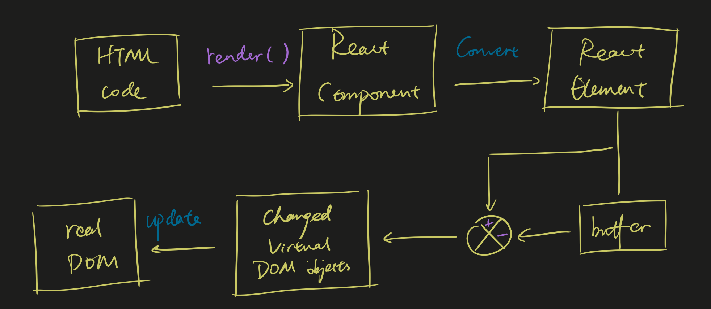

# React Virtual DOM

render: 
re-paint:

## 0. What is DOM?

The **Document Object Model** (**DOM**) is the data representation of the objects that comprise the structure and content of a document on the web. DOM doesn't belong to JavaScript, it's a set of APIs provided by the browser for JavaScript to access web content and create applications.

## 1. What is Virtual DOM?

The virtual DOM (VDOM) is a programming concept where an ideal, or “virtual”, representation of a UI is kept in memory and synced with the “real” DOM by a library such as ReactDOM. This process is called [reconciliation](https://reactjs.org/docs/reconciliation.html).

VDOM provides us the ability to refresh the whole page with limited performance consumption, it is guaranteed only elements whose states are varied are updated with DOM manipulation.

## 2. From Virtual DOM to real DOM

||Virtual DOM | innerHTML |
|---|---|---|
|Re-render Process| Render Virtual DOM<br />Diff<br />Update varied DOMs |Render HTML strings<br />Recreate all DOM elements |

Vanilla DOM operations are much more expensive than js computations, even though Virtual DOM + Diff are more consuming than Rendering HTML strings, still: Virtual DOM < innerHTML.

Example:

In practice, the update of 1,000 elements might be distributed within 20 logic blocks, each consisting of 50 elements. Every time the page needs to be refreshed, the DOM tree will also be updated.

```JavaScript
function Raw() {
    var data = _buildData(), 
        html = ""; 
    ... 
    for(var i=0; i<data.length; i++) { 
        var render = template; 
        render = render.replace("{{className}}", ""); 
        render = render.replace("{{label}}", data[i].label); 
        html += render; 
        if(!(i % 50)) {
            container.innerHTML = html;
        }
    } 
    ... 
}
```

But we cannot claim that React Virtual DOM is faster than any DOM operation, because we can literarily optimize the DOM operations manually to make them blazingly fast in a specific scenario. However, that optimization should be too time consuming and unable to maintain.

React is providing a decent performance to operate DOMs with no optimization at all.

### Steps till changes in real DOM



## 3. React Virtual DOM Principle

### 3.1 Fibers

Internal objects used to store additional information of component tree.

### 3.2 Batching

### 3.3 Diff

diff algorithm is responsible for finding the changed nodes in the DOM tree. See [this note]() for details.

## 4. Benchmarking

### MVVM Series: 
Data Binding, Inspect the change of data and maintain the reference to real DOM elements, do corresponding operations when there is updated data.

||Time Complexity|Method|
|---|---|---|
|Angular|O(Watcher Count)|Dirty Check|
|Knockout|O(change)|Dependency Collection|
|Vue|O(change)|Dependency Collection|
|Avalon|O(change)|Dependency Collection|

Dirty Check: 
* Scope Digest 
* Necessary DOM update

Dependency Collection:
* Redo Dependency Collection
* Necessary DOM update

Each line of html??? has its own data "scope", so usually each line would maintain a corresponding ViewModel Instance / "scope" object which is much more expensive than Virtual DOM.

When data source is changed, especially when data source is given a brand new object, MVVM needs to destroy all previous instances and re-create all instances, and finally re-render. Since React is inspecting changes on DOM structural level, as long as the result of the rendering remains, it won't have to make effort.

### List re-paint:
We would like to effectively re-use existing instances and DOM elements.
Same object inside DB would become different objects in 2 front-end API calls, but they share the same UID.
We can use "track by uid" to inform Angular/Vue that these objects are the same so that we can re-use the corresponding instance and DOM element.
Or we can use "track by $index" to re-use in place (re-use instances manually according to its index in the array).

[dbmon repaint rate challenge](http://vuejs.github.io/js-repaint-perfs/)

### Conclusion WRT Scenarios
|Scenario|Priority|
|---|---|
|Initial Rendering|Virtual DOM > Dirty Check >= Dependency Collection|
|Small amount of data updates|Dependency Collection >> Virtual DOM (+ opt) > Dirty Check (cannot opt) > Virtual DOM (no opt)|
|Large amount of data updates|Dirty Check (+ opt) >= Dependency Collection (+ opt) > Virtual DOM (cannot opt) >> MVVM (no opt)|


## Preact Virtual Nodes

See:

- [The Easy Parts](https://medium.com/@asolove/preact-internals-1-the-easy-parts-3a081fa36205)
- [The Component Model](https://medium.com/@asolove/preact-internals-2-the-component-model-36a05e32957b)
- [Some Fiddly Little Bits](https://medium.com/@asolove/preact-internals-3-some-fiddly-little-bits-f353b1ad7abc)

### Reference

https://developer.mozilla.org/en-US/docs/Web/API/Document_Object_Model/Introduction

https://reactjs.org/docs/faq-internals.html

http://www.alloyteam.com/2015/10/react-virtual-analysis-of-the-dom/

https://medium.com/coffee-and-codes/hey-react-what-is-the-virtual-dom-466ec333bf9a