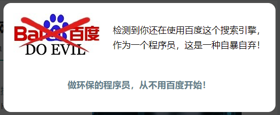

# REPRO
1. search `coolshell.cn` on baidu
2. click on its official site
3. `coolshell` will show a popup window saying "using Baidu is doing evil"



# IMPLEMENTATION
```js
// minified version
!function(){var e,n=function(){var e=document.referrer;if(("undefined"!=typeof isTest&&(e=TestURL),e&&-1<e.search("http[s]?://"))&&-1<e.match(/:\/\/(.[^/]+)/)[1].indexOf("baidu.com"))return!0;return!1}();n&&(e=function(){jQuery.getScript("https://cdn.jsdelivr.net/gh/dinbror/bpopup@0.11.0/jquery.bpopup.min.js").done(function(){var e;(e=jQuery)(document).ready(function(){e("body").append('<div id="nobaidu_dlg" style="background-color:#fff; border-radius:15px;color:#000;display:none;padding:20px;min-width:450px;min-height:180px;"><p style="margin-left:200px;margin-top: 20px; line-height: 30px;">检测到你还在使用百度这个搜索引擎，<br>作为一个程序员，这是一种自暴自弃！<br><br></p><p align="center" style="margin-top:20px;"><b><a href="http://coolshell.cn/articles/9308.html">做环保的程序员，从不用百度开始！</a></b></p></div>'),n&&e("#nobaidu_dlg").bPopup()})}).fail(function(){})},"undefined"==typeof jQuery?function(e,n){var t=document.createElement("script");t.src=e;var i=document.getElementsByTagName("head")[0],d=!1;t.onload=t.onreadystatechange=function(){d||this.readyState&&"loaded"!=this.readyState&&"complete"!=this.readyState||(d=!0,n(),t.onload=t.onreadystatechange=null,i.removeChild(t))},i.appendChild(t)}("https://cdn.jsdelivr.net/npm/jquery@1.12.4/dist/jquery.min.js",function(){"undefined"!=typeof jQuery&&e()}):e())}();
```


```html
<script src="http://ajax.googleapis.com/ajax/libs/jquery/1.9.0/jquery.min.js"></script>
<script src="https://coolshell.cn/wp-content/themes/inove/js/jquery.bpopup-0.8.0.min.js"></script>

<script type="text/javascript">
;(function($) {
    $(function() {
        var url=document.referrer;
        if ( url && url.search("http://")>-1) {
            var refurl =  url.match(/:\/\/(.[^/]+)/)[1];
            if(refurl.indexOf("baidu.com")>-1){
                $('#nobaidu_dlg').bPopup();
            }
        }
    });

})(jQuery);
</script>

<div id="nobaidu_dlg" style="background-color:#fff; border-radius:15px;color:#000;display:none;padding:20px;min-width:450px;min-height:180px;">
    
     <p style="margin-left:200px;margin-top: 20px; line-height: 30px;">
     检测到你还在使用百度这个搜索引擎，<br/>
     做为一个程序员，这是一种自暴自弃！<br/>
     <br/>
     </p>
     <p align="center" style="margin-top:20px;">
     <b><a href="https://coolshell.cn/articles/7186.html">作环保的程序员，从不用百度开始！</a></b>
     </p>
</div>
```


# ANALYSIS
## `jQuery.bPopup`

## `referer policy`

## HOW to revert minified js script


# REFERENCE
original blog: https://coolshell.cn/articles/9308.html
source code: https://github.com/lurongkai/anti-baidu
referrer policy: https://developer.mozilla.org/en-US/docs/Web/HTTP/Headers/Referrer-Policy
referrer anti-theft chain: https://blog.csdn.net/u010537398/article/details/96429932
