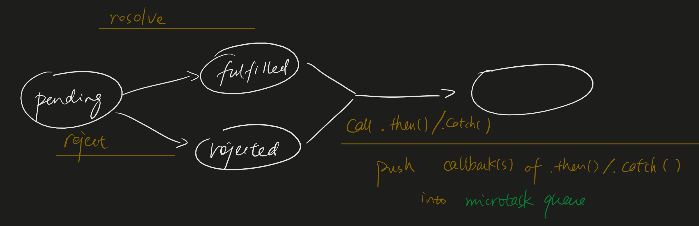

# Event Loop

### Microtask v.s. Macrotask

Each JS thread has an event loop, beginning with a macrotask and ended with a queue of microtasks.

An event loop will be executed right after JS stack is empty.

| Macrotask (Task Queue) | Microtask |
|----|----|
|setTimeout | process.nextTick|
|setInterval | Promises|
|setImmediate | Object.observe|
|requestAnimationFrame | MutationObserver|
|I/O | |
|UI rendering | |

### What do Promises do when they are settled?

### When is a microtask executed?
* after macrotask callbacks only when task stack empty
* end of each task
Note: Newly added microtasks during execution of a microtask will be appended to the microtask queue.

### Why microtask?
* microtasks are invented for scheduling tasks that should be executed immediately after the currently executed script ends.

setTimeout(callback, ms)

* Run the following steps in parallel:
  * wait ms milliseconds
  * queue a task to run the following steps
    * invoke callback

### Reference

[https://tuobaye.com/2017/10/24/%E9%80%9A%E8%BF%87microtasks%E5%92%8Cmacrotasks%E7%9C%8BJavaScript%E5%BC%82%E6%AD%A5%E4%BB%BB%E5%8A%A1%E6%89%A7%E8%A1%8C%E9%A1%BA%E5%BA%8F/](https://tuobaye.com/2017/10/24/通过microtasks和macrotasks看JavaScript异步任务执行顺序/)

https://jakearchibald.com/2015/tasks-microtasks-queues-and-schedules/?utm_source=html5weekly&utm_medium=email

https://www.youtube.com/watch?v=cCOL7MC4Pl0