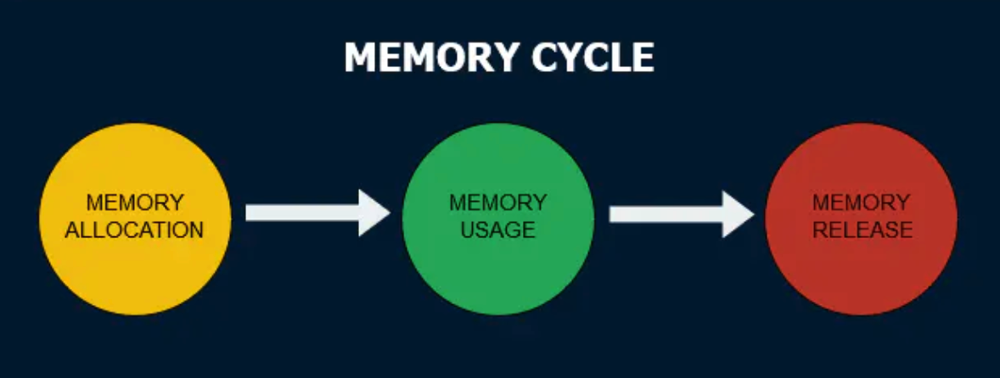

# Memory Cycle



### Memory Allocation


### Garbage Collection (GC)

1. Reference-Counting

   This is the most naive garbage collection algorithm. This algorithm reduces the problem from determining whether or not an object is still needed to determining if an object still has any other objects referencing it. An object is said to be "garbage", or collectible if there are zero references pointing to it.

   <strong>Limitation: Circular Reference</strong>

```JavaScript
var div;
window.onload = function() {
    div = document.getElementById('myDivElement');
    div.circularReference = div;
    div.lotsOfData = new Array(10000).join('*');
};
```

2. Mark-and-Sweep

   This algorithm reduces the definition of "an object is no longer needed" to "an object is unreachable".

   This algorithm assumes the knowledge of a set of objects called *roots.* In JavaScript, the root is the global object. Periodically, the garbage collector will start from these roots, find all objects that are referenced from these roots, then all objects referenced from these, etc. Starting from the roots, the garbage collector will thus find all *reachable* objects and collect all non-reachable objects.

   <strong>Limitation: Releasing memory manually</strong>

   As of 2019, it is not possible to explicitly or programmatically trigger garbage collection in JavaScript.

### Memory Leak

In essence, memory leaks can be defined as memory that is not required by an application anymore that for some reason is not returned to the operating system or the pool of free memory.

There are 4 common types of memory leak scenarios:

1. **Global Variable**

   ```JavaScript
   // scenario 1
   function foo(arg) {
       bar = "this is a hidden global variable";
   }
   foo();
   console.log(bar); // this is a hidden global variable
   ```

   ```JavaScript
   // scenario 2
   function foo() {
       this.variable = "potential accidental global";
   }
   
   // Foo called on its own, this points to the global object (window)
   // rather than being undefined.
   foo();
   console.log(variable); // potential accidental global
   ```

   **Solution: **

   'use strict'

   ```JavaScript
   // scenario 1
   function foo(arg) {
       'use strict';
       this.bar = "this is a hidden global variable";
   }
   
   foo();
   console.log(bar);
   // pen.js:4 Uncaught TypeError: Cannot set property 'bar' of undefined
   ```

   ```JavaScript
   // scenario 2
   function foo() {
     	'use strict';
       this.variable = "potential accidental global";
   }
   
   // Foo called on its own, this points to the global object (window)
   // rather than being undefined.
   foo();
   console.log(variable); // potential accidental global
   
   // pen.js:5 Uncaught TypeError: Cannot set property 'variable' of undefined
   ```

2. **Forgotten timer or callback**

   ```JavaScript
   var someResource = getData();
   setInterval(function() {
       var node = document.getElementById('Node');
       if(node) {
           // Do stuff with node and someResource.
           node.innerHTML = JSON.stringify(someResource));
       }
   }, 1000);
   ```

   ??

   Don't quite get how to solve this issue, is it just to avoid referencing large data in a timer / callback?

   ```JavaScript
   function Test() {  
       this.obj= {};
       this.index = 1;
       this.timer = null;
       var cache = []; // internal variable，potential memory leak risk...
       this.timer = window.setInterval(() =>{
           this.index += 1; 
           this.obj = {
               val: '_timerxxxxxbbbbxx_' + this.index,
               junk: [...cache]
           };
           cache.push(this.obj);
       }, 1);  
       console.warn("create Test instance..");
   }  
   test = new Test(); // js object open timer and allocate memory continuously
   
   // cannot reproduce this memory leak issue on Chrome
   // reference: https://juejin.im/post/5a8e7f6df265da4e832677ec
   ```

3. **DOM reference**

   Sometimes it may be useful to store DOM nodes inside data structures. Suppose you want to rapidly update the contents of several rows in a table. It may make sense to store a reference to each DOM row in a dictionary or array. When this happens, two references to the same DOM element are kept: one in the DOM tree and the other in the dictionary. If at some point in the future you decide to remove these rows, you need to make both references unreachable.

   ```JavaScript
   // 1. object is referencing `button` element
   // 2. document is referencing `button` element
   var elements = {
       button: document.getElementById('button'), 
       image: document.getElementById('image'),
       text: document.getElementById('text')
   };
   
   function doStuff() {
       image.src = 'http://some.url/image';
       button.click();
       console.log(text.innerHTML);
       // Much more logic
   }
   
   function removeButton() {
       // The button is a direct child of body.
       document.body.removeChild(document.getElementById('button'));
   
       // At this point, we still have a reference to #button in the global
       // elements dictionary. In other words, the button element is still in
       // memory and cannot be collected by the GC.
   }
   ```

   

4. **Closure**

   This snippet does one thing: every time `replaceThing` is called, `theThing` gets a new object which contains a big array and a new closure (`someMethod`). At the same time, the variable `unused` holds a closure that has a reference to `originalThing` (`theThing` from the previous call to `replaceThing`). Already somewhat confusing, huh? The important thing is that once a scope is created for closures that are in the same parent scope, that scope is shared. In this case, the scope created for the closure `someMethod` is shared by `unused`. `unused` has a reference to `originalThing`. Even though `unused` is never used, `someMethod` can be used through `theThing`. And as `someMethod` shares the closure scope with `unused`, even though `unused` is never used, its reference to `originalThing` forces it to stay active (prevents its collection). When this snippet is run repeatedly a steady increase in memory usage can be observed. This does not get smaller when the GC runs. In essence, a linked list of closures is created (with its root in the form of the `theThing` variable), and each of these closures' scopes carries an indirect reference to the big array, resulting in a sizable leak.

   ```JavaScript
   var theThing = null;
   var replaceThing = function () {
       var originalThing = theThing;
       var unused = function () {
         	if (originalThing)
           		console.log("hi");
       };
       theThing = {
           longStr: new Array(1000000).join('*'),
           someMethod: function () {
             	console.log(someMessage);
           }
       };
   };
   setInterval(replaceThing, 1000);
   ```

   

### How to prevent Memory Leak


### Reference

https://auth0.com/blog/four-types-of-leaks-in-your-javascript-code-and-how-to-get-rid-of-them/