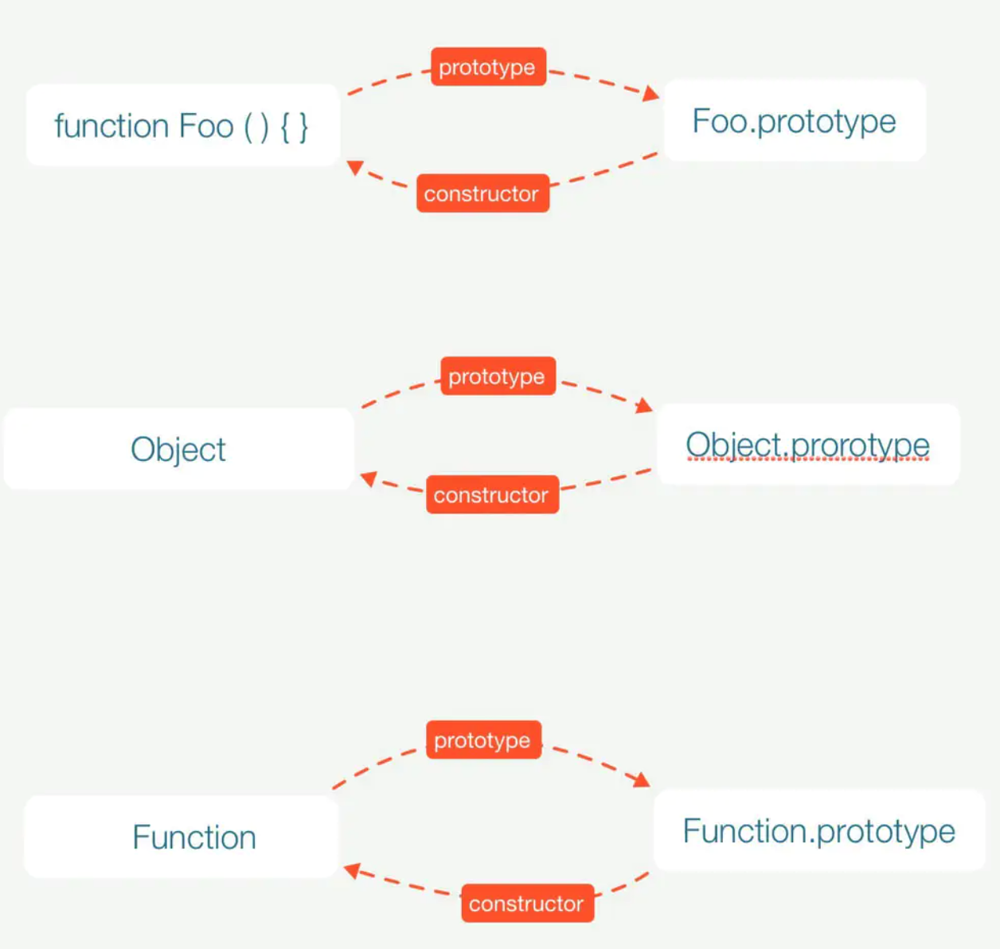
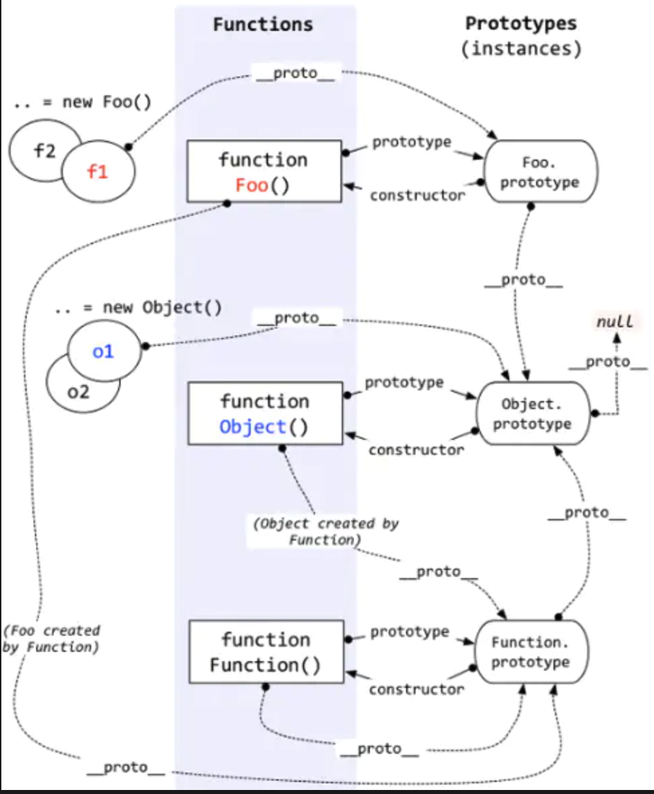

# Prototype Chain

## Prerequisite:



||Description|
|---|---|
|prototype|explicit prototype property, points at the prototype object of the Function<br />only a function has this property|
|\__proto__|implicit prototype property, points at the constructor function's prototype which creates the object<br />every object has this property|
|constructor|points at the constructor function of the prototype object|

```JavaScript
function Foo() {}

console.log(Foo.prototype)
// Object
//     constructor: ƒ Foo()
//     __proto__: Object
console.log(Foo.prototype.constructor) 	// ƒ Foo() {}
console.log(Foo.__proto__)							// ƒ () { [native code] }
console.log(Foo.prototype.__proto__)		
// Object
//     b: "b"
//     constructor: ƒ Object()
//     hasOwnProperty: ƒ hasOwnProperty()
//     isPrototypeOf: ƒ isPrototypeOf()
//     propertyIsEnumerable: ƒ propertyIsEnumerable()
//     toLocaleString: ƒ toLocaleString()
//     toString: ƒ toString()
```



### Conclusion: 

xxx.\__proto__ = xxx.constructor.prototype

```JavaScript
function Foo() {}
Foo.__proto__ === Foo.constructor.prototype
// true
```

## What essentially is Prototype Chain?

Let's say we want to look up a property `p` in `f`, where `f` is an instance of `Foo`:

```JavaScript
let f = new Foo();
console.log(f.p);

// f does not have a property `p`, so it will look further into f.__proto__, which is Foo.prototype
// Foo.prototype does not have property `p` either, so it will go ahead to search Foo.prototype.__proto__, which is Object.prototype

// this look up process is going through a so-called Prototype Chain
// f --> Foo.prototype --> Object.prototype
```

An example in practice:

```JavaScript
function Father() {
  	console.log("constructing: ", this);
		this.property = true;
}
Father.prototype.getFatherValue = function() {
		return this.property;
}
function Son() {
		this.sonProperty = false;
}
console.log(Father.prototype);					// {getFatherValue: ƒ, constructor: ƒ}
console.log(Son.prototype);							// {constructor: ƒ}
console.log(Son.prototype.constructor);	// function Son()
// Inherit Father
Son.prototype = new Father(); // Override Son.prototype and Son.prototype.constructor
Son.prototype.getSonVaule = function() {
		return this.sonProperty;
}
// Instantiate Son object
var son = new Son();
console.log(son.getFatherValue()); 			// true
console.log(Father.prototype);					// {getFatherValue: ƒ, constructor: ƒ}
console.log(Son.prototype);							// Father {property: true, getSonVaule: ƒ}: An anonymous instance of Father
console.log(Son.prototype.constructor);	// function Father()
```

So, if we want to make an object A inherit another object B, we are actually overriding the prototype of object A to become an instance of object B and also overriding the constructor of object A's prototype. Thus, when the instance of object A is initiated, it will inherit properties from object B.

```JavaScript
// what happened after:
Son.prototype = new Father();

// 1. `Son.prototype` becomes an anonymous instance of `Father`
// 2. `Son.prototype.constrcutor` becomes the constructor of `Father`, which is `Father()`

// what happened after: 
var son = new Son();

// 1. the constructor `Father()` is called to instantiate a `Son` object
// 2. point `son.__proto__` at `Son.prototype`, which is that anonymous instance of `Father`
// 3. alter the context of `this`, point it at the newly created object
// 4. pass the newly created object to `son`
```

## Methods to check relationships between instances and prototypes

### 1. instanceof

`A instanceof B` checks existance of `B.prototype` along the prototype chain of `A`

```JavaScript
console.log(son instanceof Object); // true
console.log(son instanceof Father); // true
console.log(son instanceof Son); 		// true
```

### 2. isPrototypeOf

`B.prototype.isPrototypeOf(A)` is the same as `A instanceof B`

```JavaScript
console.log(Object.prototype.isPrototypeOf(son));	//true
console.log(Father.prototype.isPrototypeOf(son));	//true
console.log(Son.prototype.isPrototypeOf(son));		//true
```

### 3. 


# JS Object Oriented Programming

1. Multiple ways to create an object
2. Inheritance
3. Encapsulation
4. Polymorphism

## 1. 

## 2. 

## 3. Encapsulation

### Problems of Prototype Chain

* If there's presence of a complex type variable, the reference of this complex type variable will be shared by all instances.
* Cannot pass arguments to the constructor of parent object (e.g. Father) when creating child object (e.g. son)

### Solution 1: Constructor Stealing

Call the constructor of parent object manully inside child object to alter the context of `this`

```JavaScript
function Father(){
		this.colors = ["red","blue","green"];
}
function Son(){
		Father.call(this);			// we can pass arguments to parent constructor here
}
var son1 = new Son();
son1.colors.push("black");
console.log(son1.colors);		// "red,blue,green,black"

var son2 = new Son();
console.log(son2.colors);		// "red,blue,green", children objects don't share the same reference to a complex property any more
```

### Problem of Constructor Stealing

1. Methods defined in parent object outside the constructor will not be accessible to child objects
2. We have to define every method inside constructor, so that the parent object will not be reusable

```JavaScript
function Father(){
		this.colors = ["red","blue","green"];
}
Father.prototype.show = function() {
  	console.log("show");
}
function Son(){
		Father.call(this);			// we can pass arguments to parent constructor here
}
var son1 = new Son();
son1.show();								// Uncaught TypeError: son1.show is not a function
```

### Solution 2: Combined Inheritance

This is a method combining advantages of classical inheritance and constructor stealing technique. Prototype inheritance is responsible for inheriting prototype properties and methods while constructor stealing takes care of the inheritance of instance properties.

```JavaScript
function Father(name) {
    this.name = name;
    this.colors = ["red","blue","green"];
}
Father.prototype.sayName = function() {
		console.log(this.name);
};
function Son(name,age){
    Father.call(this, name);		// inherit instance property，call Father() 1st time
    this.age = age;
}
Son.prototype = new Father();		// inherit parent prototype property, call Father() 2nd time
Son.prototype.sayAge = function() {
		console.log(this.age);
}
var son1 = new Son("Louis", 5);
son1.colors.push("black");
console.log(son1.colors);				// "red,blue,green,black"
son1.sayName();									// louis
son1.sayAge();									// 5

var son2 = new Son("John",10);
console.log(son2.colors);				// "red,blue,green"
son2.sayName();									// John
son2.sayAge();									// 10
```

### Problem of Combined Inheritance

It will call Father() constructor function twice, making redundant consumption.

### Solution 3: Prototypal Inheritance

* Create a temporary constructor function inside the original constructor function
* Append the object passed in to prototype of the constructor
* Return a new instance of this temporary object

```JavaScript
function object(o){
    function F(){}		// temporary constructor
    F.prototype = o;	// append object passed in
    return new F();		// return instance
}
```

### Problem of Prototypal Inheritance

Different instances of the object will share complex type properties.

```JavaScript
var person = {
		friends : ["Van","Louis","Nick"]
};
var anotherPerson = object(person);
anotherPerson.friends.push("Rob");
var yetAnotherPerson = object(person);
yetAnotherPerson.friends.push("Style");
console.log(person.friends);									// ["Van", "Louis", "Nick", "Style"]
```

This problem is solved in ES5 via `Object.create()`

```JavaScript
Object.create(proto, [propertiesObject])
```

* proto

  The object which should be the prototype of the newly-created object. 

* propertiesObject

  If specified and not [`undefined`](https://developer.mozilla.org/en-US/docs/Web/JavaScript/Reference/Global_Objects/undefined), an object whose enumerable own properties (that is, those properties defined upon itself and *not* enumerable properties along its prototype chain) specify property descriptors to be added to the newly-created object, with the corresponding property names. These properties correspond to the second argument of [`Object.defineProperties()`](https://developer.mozilla.org/en-US/docs/Web/JavaScript/Reference/Global_Objects/Object/defineProperties).

```JavaScript
var person = {
		friends : ["Van","Louis","Nick"]
};
var anotherPerson = Object.create(person, {
    friends : {
      	value : ["Van","Louis","Nick","Style"]
    }
});
console.log(anotherPerson.friends);					// ["Van", "Louis", "Nick", "Style"]
console.log(person.friends);								// ["Van", "Louis", "Nick"]
```

### Parasitic Inheritance

Parasitic Inheritance takes use of the factory mode, it creates a function which is only used to encapsulate objects, the object can be enhanced within the function and then returned.

```JavaScript
// prototypal inheritance
function object(o){
    function F(){}
    F.prototype = o;
    return new F();
}

// parasitic inheritance
function createAnother(original){
    var clone = object(original);		// create a new object with object() function
    clone.sayHi = function() {			// enhance the object
      	console.log("hi");
    };
    return clone;										
}
```

### Problem of Parasitic Inheritance

Also, methods defined in this way cannot be reusable.

## Parasitic Combined Inheritance

We don't have to call the constructor of the parent object when assigning prototype for child object.

```JavaScript
function extend(subClass, superClass) {
    var F = function() {};
    F.prototype = superClass.prototype;
    subClass.prototype = new F(); 
    subClass.prototype.constructor = subClass;

    subClass.superclass = superClass.prototype;
    if (superClass.prototype.constructor == Object.prototype.constructor) {
      	superClass.prototype.constructor = superClass;
    }
}
```


## 4.

# Methods to check types and object prototypes

`toString`, `valueOf`, `typeof`, `instanceof`?

||Description / Usage|
|---|---|
|toString|returns a string representing the object|
|valueOf|returns the primitive value of the specified object|
|typeof|determine type of an expression:<br />number, boolean, string, function, object, undefined|
|instanceof|determine whether operand 1 is an instance of operand 2 along the prototype chain|
|isPrototypeOf|determine whether the caller is a prototype of the argument|
|Object.prototype.toString.call(targetObj).slice(8, -1)|best way to check type of a variable|

```JavaScript
function f(){
    if(this instanceof arguments.callee)
      	console.log('this is a constructor function');
    else
      	console.log('this is a normal function');
}
f();			//this is a normal function
new f();	//this is a constructor function
```


### Reference

https://juejin.im/post/5d713de26fb9a06ad3474c15

https://juejin.im/post/5c72a1766fb9a049ea3993e6

https://juejin.im/post/58f94c9bb123db411953691b

https://www.crockford.com/javascript/prototypal.html

https://developer.mozilla.org/en-US/docs/Web/JavaScript/Reference/Global_Objects/Object/create

https://www.jianshu.com/p/a1238c370d75

