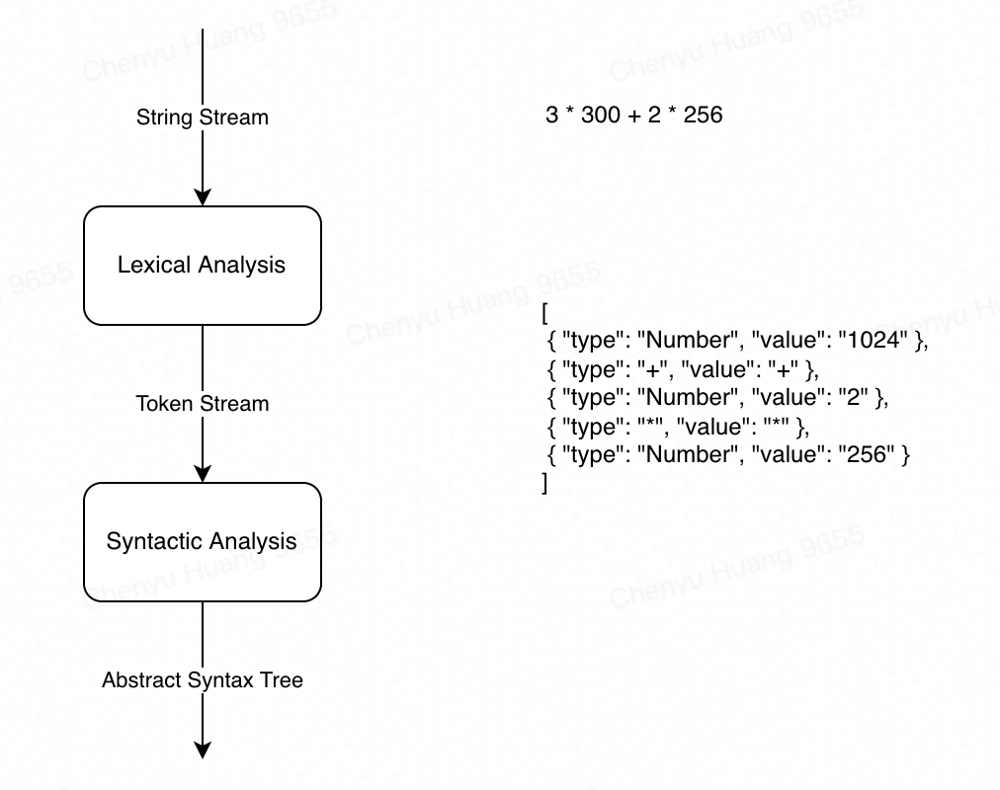
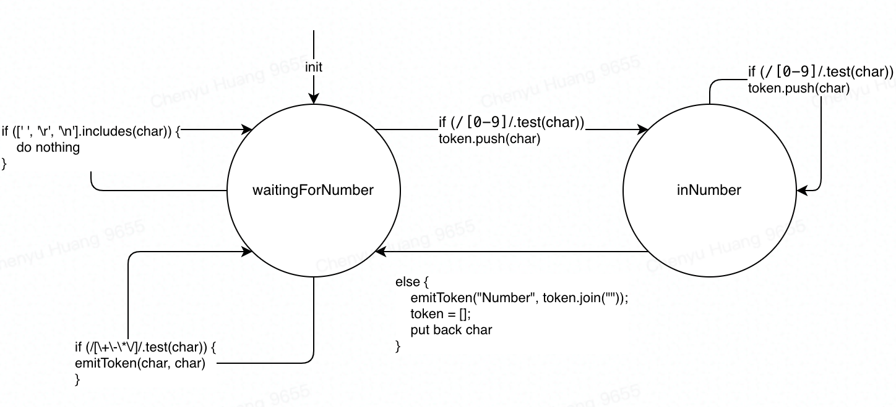
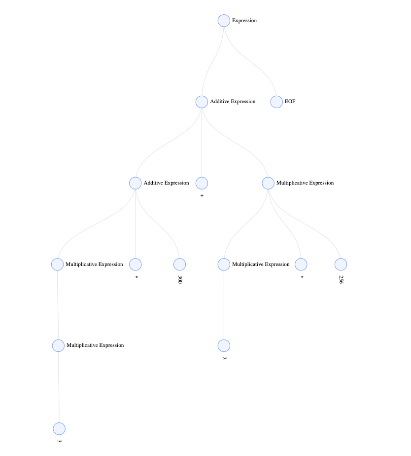

# JS Compilation

## A Case Study on Fundamental Arithmetics



### Definition

#### Lexeme Definition

```ts
1 + 2 * 3
```

We only have 4 elements: `number`, `operator`, `space`and `line-terminator`

- Token: 
  - Number: 1,2,3,4,5,6,7,8,9,0
  - Operator: `+`, `-`, `*`, `/`
  - Whitespace: `<sp>`
  - LineTerminator: `<LF>`,`<CR>`

#### Syntax Definition 

aka. Grammar Generation

below is a BNF-like notation.

```bash
<Expression> ::= 
    <AdditiveExpression><EOF>
```

```bash
<AdditiveExpression> ::= 
    <MultiplicativeExpression>
    |<AdditiveExpression><+><MultiplicativeExpression>
    |<AdditiveExpression><-><MultiplicativeExpression>
```

```bash
<MultiplicativeExpression> ::= 
    <Number>
    |<MultiplicativeExpression><*><Number>
    |<MultiplicativeExpression></><Number>
```

### Lexical Analysis

Lexical Analysis is essentially a process of converting a string stream into a token stream.

There are 2 solutions to lexical analysis: `State Machine` and `Regular Expression`

- State Machine

States can be expressed with functions, while state transitions can be expressed with conditions.



```js
class LexicalAnalyzer {
    constructor(str) {
        this.str = str;
        this.charCache = [];
        this.tokens = [];
        this.EOF = Symbol("EOF");
    }

    start = () => {
        let state = this.waitingForNumber;
        for (const char of this.str) {
            state = state(char);
        }
        state(this.EOF);
    };

    end = () => {};

    waitingForNumber = (char) => {
        if (/[0-9]/.test(char)) {
            this.charCache.push(char);
            return this.inNumber;
        }
        if (["+", "-", "*", "/"].includes(char)) {
            this.emitToken(char, char);
            return this.waitingForNumber;
        }
        if ([" ", "\n", "\r"].includes(char)) {
            return this.waitingForNumber;
        }
    };

    inNumber = (char) => {
        // edge case: EOF
        if (char === this.EOF) {
            this.emitToken("Number", this.charCache.join(""));
            this.charCache = [];
            return this.end;
        }
        if (/[0-9]/.test(char)) {
            this.charCache.push(char);
            return this.inNumber;
        }
        this.emitToken("Number", this.charCache.join(""));
        this.charCache = [];
        return this.waitingForNumber(char); // put back char
    };

    emitToken = (type, value) => {
        this.tokens.push({
            type,
            value,
        });
    };
}

const la = new LexicalAnalyzer("3*300+2*256");
la.start();
console.log(la.tokens);
// [
//     { type: 'Number', value: '3' },
//     { type: '*', value: '*' },
//     { type: 'Number', value: '300' },
//     { type: '+', value: '+' },
//     { type: 'Number', value: '2' },
//     { type: '*', value: '*' },
//     { type: 'Number', value: '256' }
// ]
```


- Regular Expression


### Syntactic Analysis



The code below works but it looks really weird, could be refactored. The reason why I think it's weird is that all the functions look immutable by looking at their names, they should return some new expressions, but they are actually mutating the inputs. Okay, so they are mutable, but they are also returning something at the end. The combination of these 2 patterns makes me confused, which should be better organized.

```js
function AdditiveExpression(source) {
    if (source[0].type === "MultiplicativeExpression") {
        let node = {
            type: "AdditiveExpression",
            children: [source[0]],
        };
        source[0] = node;
        return AdditiveExpression(source);
    }
    if (
        source[0].type === "AdditiveExpression" &&
        source[1] &&
        source[1].type === "+"
    ) {
        let node = {
            type: "AdditiveExpression",
            operator: "+",
            children: [],
        };
        node.children.push(source.shift());
        node.children.push(source.shift());
        MultiplicativeExpression(source);
        node.children.push(source.shift());
        source.unshift(node);
        return AdditiveExpression(source);
    }
    if (
        source[0].type === "AdditiveExpression" &&
        source[1] &&
        source[1].type === "-"
    ) {
        let node = {
            type: "AdditiveExpression",
            operator: "-",
            children: [],
        };
        node.children.push(source.shift());
        node.children.push(source.shift());
        MultiplicativeExpression(source);
        node.children.push(source.shift());
        source.unshift(node);
        return AdditiveExpression(source);
    }
    if (source[0].type === "AdditiveExpression") return source[0];
    MultiplicativeExpression(source);
    return AdditiveExpression(source);
}

function MultiplicativeExpression(source) {
    if (source[0].type === "Number") {
        let node = {
            type: "MultiplicativeExpression",
            children: [source[0]],
        };
        source[0] = node;
        return MultiplicativeExpression(source);
    }
    if (
        source[0].type === "MultiplicativeExpression" &&
        source[1] &&
        source[1].type === "*"
    ) {
        let node = {
            type: "MultiplicativeExpression",
            operator: "*",
            children: [],
        };
        node.children.push(source.shift());
        node.children.push(source.shift());
        node.children.push(source.shift());
        source.unshift(node);
        return MultiplicativeExpression(source);
    }
    if (
        source[0].type === "MultiplicativeExpression" &&
        source[1] &&
        source[1].type === "/"
    ) {
        let node = {
            type: "MultiplicativeExpression",
            operator: "/",
            children: [],
        };
        node.children.push(source.shift());
        node.children.push(source.shift());
        node.children.push(source.shift());
        source.unshift(node);
        return MultiplicativeExpression(source);
    }
    if (source[0].type === "MultiplicativeExpression") return source[0];

    return MultiplicativeExpression(source);
}

function Expression(source) {
    if (
        source[0].type === "AdditiveExpression" &&
        source[1] &&
        source[1].type === "EOF"
    ) {
        let node = {
            type: "Expression",
            children: [source.shift(), source.shift()],
        };
        source.unshift(node);
        return node;
    }
    AdditiveExpression(source);
    return Expression(source);
}

const source = [
    {
        type: "Number",
        value: "3",
    },
    {
        type: "*",
        value: "*",
    },
    {
        type: "Number",
        value: "300",
    },
    {
        type: "+",
        value: "+",
    },
    {
        type: "Number",
        value: "2",
    },
    {
        type: "*",
        value: "*",
    },
    {
        type: "Number",
        value: "256",
    },
    {
        type: "EOF",
    },
];
const ast = Expression(source);
```

```js
// {
//   "type": "Expression",
//   "children": [
//     {
//       "type": "AdditiveExpression",
//       "operator": "+",
//       "children": [
//         {
//           "type": "AdditiveExpression",
//           "children": [
//             {
//               "type": "MultiplicativeExpression",
//               "operator": "*",
//               "children": [
//                 {
//                   "type": "MultiplicativeExpression",
//                   "children": [
//                     {
//                       "type": "Number",
//                       "value": "3"
//                     }
//                   ]
//                 },
//                 {
//                   "type": "*",
//                   "value": "*"
//                 },
//                 {
//                   "type": "Number",
//                   "value": "300"
//                 }
//               ]
//             }
//           ]
//         },
//         {
//           "type": "+",
//           "value": "+"
//         },
//         {
//           "type": "MultiplicativeExpression",
//           "operator": "*",
//           "children": [
//             {
//               "type": "MultiplicativeExpression",
//               "children": [
//                 {
//                   "type": "Number",
//                   "value": "2"
//                 }
//               ]
//             },
//             {
//               "type": "*",
//               "value": "*"
//             },
//             {
//               "type": "Number",
//               "value": "256"
//             }
//           ]
//         }
//       ]
//     },
//     {
//       "type": "EOF"
//     }
//   ]
// }
```


Left Derivation (written by Copilot)

```js

const leftDerivation = (input) => {
    const stack = [];
    const output = [];
    let i = 0;
    let current = input[i];
    while (current) {
        if (current === "(") {
            stack.push(current);
        } else if (current === ")") {
            while (stack[stack.length - 1] !== "(") {
                output.push(stack.pop());
            }
            stack.pop();
        } else if (
            current === "+" ||
            current === "-" ||
            current === "*" ||
            current === "/"
        ) {
            while (
                stack.length > 0 &&
                stack[stack.length - 1] !== "(" &&
                precedence(current) <= precedence(stack[stack.length - 1])
            ) {
                output.push(stack.pop());
            }
            stack.push(current);
        } else {
            output.push(current);
        }
        i++;
        current = input[i];
    }
    while (stack.length > 0) {
        output.push(stack.pop());
    }
    return output;
};

console.log(leftDerivation("(1+2)*3"));
```


### Interpreting and Executing


## Reference

https://en.wikipedia.org/wiki/Lexical_analysis

https://en.wikipedia.org/wiki/Production_(computer_science)

https://en.wikipedia.org/wiki/LL_parser

（小实验）理解编译原理：一个四则运算的解释器 Credit To: Winter

