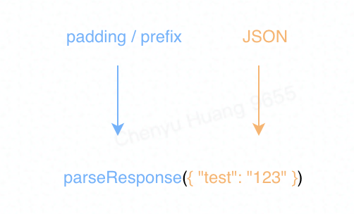
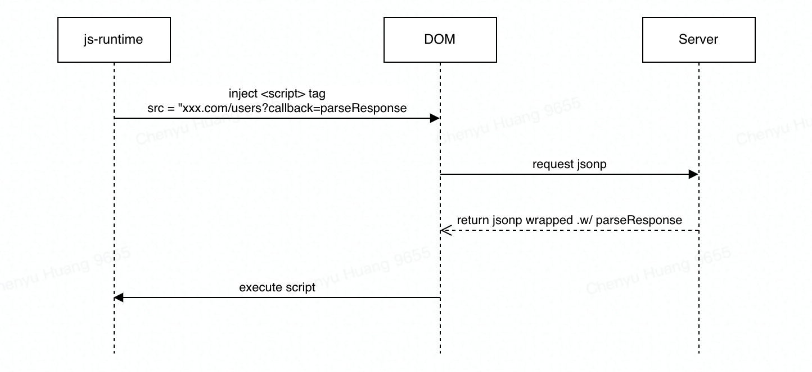
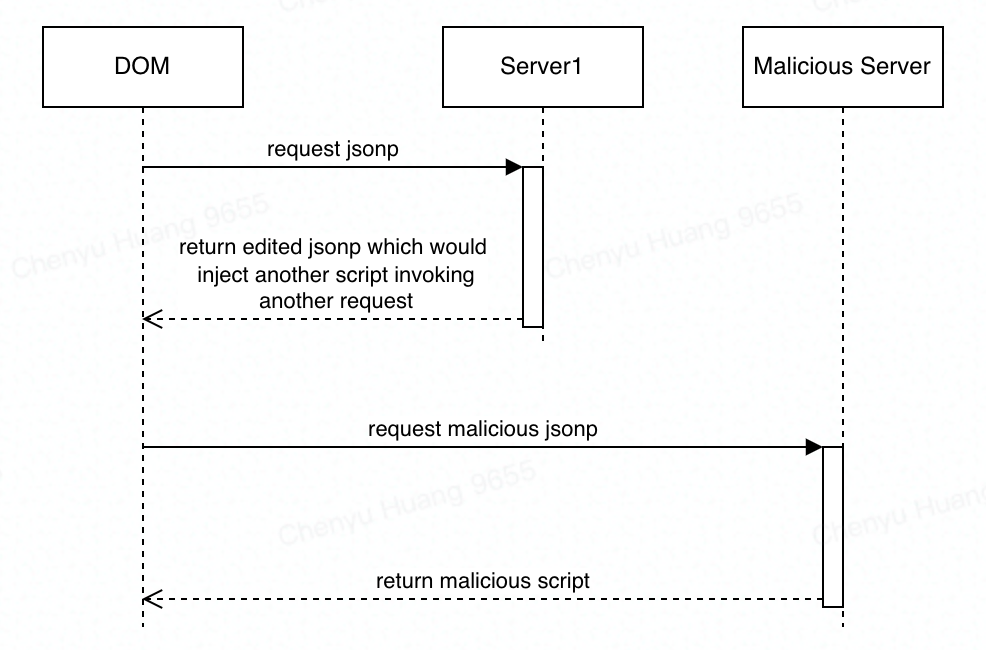

# JSONP

## What is JSONP

- Requesting data by <script> element
- Bypassing same-origin policy -> Vulnerability

**JSONP**, or **JSON-P** (JSON with Padding), is an historical [JavaScript](https://en.wikipedia.org/wiki/JavaScript) technique for requesting data by loading a `<script>` element,[[1\]](https://en.wikipedia.org/wiki/JSONP#cite_note-JSON-P-1) which is an element intended to load ordinary JavaScript. It was proposed by Bob Ippolito in 2005.[[2\]](https://en.wikipedia.org/wiki/JSONP#cite_note-2) JSONP enables sharing of data bypassing [same-origin policy](https://en.wikipedia.org/wiki/Same-origin_policy), which disallows running JavaScript code to read media [DOM](https://en.wikipedia.org/wiki/Document_Object_Model) elements or [XMLHttpRequest](https://en.wikipedia.org/wiki/XMLHttpRequest) data fetched from outside the page's originating site. The originating site is indicated by a combination of [URI scheme, host name, and port number](https://en.wikipedia.org/wiki/Uniform_Resource_Identifier).

JSONP is vulnerable to the data source replacing the innocuous function call with malicious code, which is why it has been superseded by [cross-origin resource sharing](https://en.wikipedia.org/wiki/Cross-origin_resource_sharing) (available since 2009[[3\]](https://en.wikipedia.org/wiki/JSONP#cite_note-caniuse-cors-3)) in modern applications.



> The function call to parseResponse() is the "P" of JSONP—the "padding" or "prefix" around the pure JSON.

## How to use JSONP



JSONP makes sense only when used with a script element. For each new JSONP request, the browser must add a new `<script>` element, or reuse an existing one. The former option—adding a new script element—is done via dynamic DOM manipulation, and is known as *script element injection*. The `<script>` element is injected into the HTML DOM, with the URL of the desired JSONP endpoint set as the "src" attribute. This dynamic *script element injection* is usually done by a JavaScript helper library. [jQuery](https://en.wikipedia.org/wiki/JQuery) and other frameworks have JSONP helper functions; there are also standalone options.

```javascript
$.getScript("http://server.example.com/Users/192.168.73.96?callback=parseResponse");
```

In the JSONP usage pattern, the URL request pointed to by the `src` attribute in the `<script>` element returns JSON data, with JavaScript code (usually a function call) wrapped around it. This "wrapped payload" is then interpreted by the browser. In this way, a function that is already defined in the JavaScript environment can manipulate the JSON data. A typical JSONP request and response are shown below.

For JSONP to work, a server must reply with a response that includes the JSONP function. JSONP does not work with JSON-formatted results. The JSONP function invocation that gets sent back, and the payload that the function receives, must be agreed upon by the client and server. By convention, the server providing the JSON data offers the requesting website to name the JSONP function, typically using the name jsonp or [callback](https://en.wikipedia.org/wiki/Callback_(computer_programming)) as the named query-string parameter, in its request to the server: `<script src="http://server.example.com/Users/1234?callback=parseResponse"></script>`.

```javascript
parseResponse({"Name": "Alice", "Id": 1234, "Rank": 7});
```

## Security Concern

### Untrusted third-party code



Including script elements from remote servers allows the remote servers to inject *any* content into a website. If the remote servers have vulnerabilities that allow JavaScript injection, the page served from the original server is exposed to an increased risk. If an attacker can inject any JavaScript into the original web page, then that code can retrieve additional JavaScript from any domain, bypassing the [same-origin policy](https://en.wikipedia.org/wiki/Same-origin_policy).[[5\]](https://en.wikipedia.org/wiki/JSONP#cite_note-5) The Content Security Policy HTTP Header lets web sites tell web browsers which domain scripts may be included from.

An effort was undertaken around 2011 to define a safer strict subset definition for JSONP[[1\]](https://en.wikipedia.org/wiki/JSONP#cite_note-JSON-P-1) that browsers would be able to enforce on script requests with a specific [MIME](https://en.wikipedia.org/wiki/MIME) type such as "application/json-p". If the response did not parse as strict JSONP, the browser could throw an error or just ignore the entire response. However, this approach was abandoned in favor of [CORS](https://en.wikipedia.org/wiki/Cross-origin_resource_sharing), and the correct MIME type for JSONP remains `application/javascript`.[[6\]](https://en.wikipedia.org/wiki/JSONP#cite_note-6)

### Whitespace differences

JSONP carries the same problems as resolving JSON with `eval()`: both interpret the JSON text as JavaScript, which means differences in handling U+2028 ([Line Separator](https://en.wikipedia.org/wiki/Newline#Unicode)) and U+2029 ([Paragraph Separator](https://en.wikipedia.org/wiki/Newline#Unicode)) from JSON proper. This makes some JSON strings non-legal in JSONP; servers serving JSONP must escape these characters prior to transmission.[[7\]](https://en.wikipedia.org/wiki/JSONP#cite_note-Magnus_Holm-7)

### Callback name manipulation and reflected file download attack

```html
<a href="http://server.example.com/Users?callback=calc||" download="setup.bat"></a>
```

```html
<a href=”https://server.example.com/Users;/setup.bat?first_name=calc||" download></a>
```

Unsanitized callback names may be used to pass malicious data to clients, bypassing the restrictions associated with `application/json` content type, as demonstrated in reflected file download (RFD) attack from 2014.[[8\]](https://en.wikipedia.org/wiki/JSONP#cite_note-8)

Insecure JSONP endpoints can be also injected with malicious data.[[9\]](https://en.wikipedia.org/wiki/JSONP#cite_note-9)

### Cross-site request forgery

Naive deployments of JSONP are subject to [cross-site request forgery](https://en.wikipedia.org/wiki/Cross-site_request_forgery) (CSRF or XSRF) attacks.[[10\]](https://en.wikipedia.org/wiki/JSONP#cite_note-10) Because the HTML `<script>` element does not respect the [same-origin policy](https://en.wikipedia.org/wiki/Same-origin_policy) in web browser implementations, a malicious page can request and obtain JSON data belonging to another site. This will allow the JSON-encoded data to be evaluated in the context of the malicious page, possibly divulging passwords or other sensitive data if the user is currently logged into the other site.

This is problematic only if the JSON-encoded data contains sensitive information which should not be disclosed to a third party, and the server depends on the [same-origin policy](https://en.wikipedia.org/wiki/Same-origin_policy) of the browser to block the delivery of the sensitive information.

### Rosetta Flash

Rosetta Flash is an exploitation technique that allows an attacker to exploit servers with a vulnerable JSONP endpoint by causing [Adobe Flash Player](https://en.wikipedia.org/wiki/Adobe_Flash_Player) to believe that an attacker-specified Flash applet originated on the vulnerable server. Flash Player implements [same-origin policy](https://en.wikipedia.org/wiki/Same-origin_policy) allowing one to make requests (with cookies) and receive responses from the hosting site. The applet can then send the retrieved data back to the attacker. This is a cross-origin exploit with an impact similar to embedding an arbitrary Flash applet in the vulnerable domain. The exploit uses an ActionScript payload compiled to an SWF file composed entirely of alphanumeric characters by crafting a [zlib](https://en.wikipedia.org/wiki/Zlib) stream with a particular header and [DEFLATE](https://en.wikipedia.org/wiki/DEFLATE) blocks with ad-hoc [Huffman coding](https://en.wikipedia.org/wiki/Huffman_coding). The resulting alphanumeric-only SWF file is then used as the callback parameter of a JSONP call. High-profile sites such as Google, YouTube, Twitter, Yahoo!, Yandex, LinkedIn, eBay, Instagram and Tumblr were all vulnerable until July 2014.[[11\]](https://en.wikipedia.org/wiki/JSONP#cite_note-11) This vulnerability was discovered and published by Google security engineer [Michele Spagnuolo](https://en.wikipedia.org/w/index.php?title=Michele_Spagnuolo&action=edit&redlink=1)[[12\]](https://en.wikipedia.org/wiki/JSONP#cite_note-12) and has [CVE](https://en.wikipedia.org/wiki/CVE_(identifier))-[2014-4671](https://cve.mitre.org/cgi-bin/cvename.cgi?name=CVE-2014-4671)[[13\]](https://en.wikipedia.org/wiki/JSONP#cite_note-13) and CVE-[2014-5333](https://cve.mitre.org/cgi-bin/cvename.cgi?name=CVE-2014-5333).[[14\]](https://en.wikipedia.org/wiki/JSONP#cite_note-14) Adobe Flash Player release version 14.0.0.145, released on July 8, 2014, introduced stronger validation of Flash files,[[15\]](https://en.wikipedia.org/wiki/JSONP#cite_note-15) and in version 14.0.0.176, released on August 12, 2014, finalized the fix,[[16\]](https://en.wikipedia.org/wiki/JSONP#cite_note-16) preventing this exploit from working.

## Practice

https://codepen.io/frostace_bd/pen/jOLJXBR

```html
<script>
		const processJSON = payload => console.log(payload);
</script>
<script src='http://api.flickr.com/services/feeds/photos_public.gne?
jsoncallback=processJSON&tags=monkey&tagmode=any&format=json'></script>
```


## Reference

https://en.wikipedia.org/wiki/JSONP

https://medium.com/@Johne_Jacob/rfd-reflected-file-download-what-how-6d0e6fdbe331

https://www.youtube.com/watch?v=FH5gmcqjp_Y

https://developer.mozilla.org/en-US/docs/Web/HTTP/Headers/Content-Security-Policy
