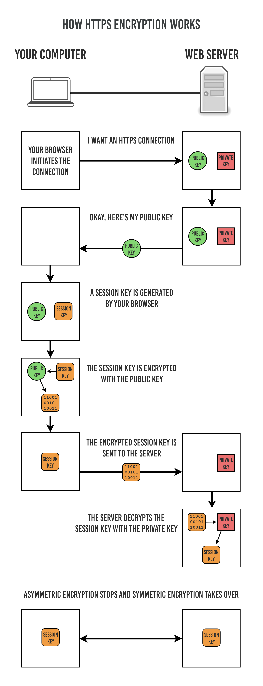

# HTTP

## HTTP Methods

* HTTP 0.9
  * 
* HTTP 1.0
  * 
* HTTP 1.1
  * 
* HTTP 2.0
  * 

## HTTP Status Code

## Versions

||Pros|Cons|
|---|---|---|
|HTTP 0.9||only `GET` no header non-persistent can only send HTML|
|HTTP 1.0|added `POST`, `HEADER` added headers and other meta-data added different format support|stateless non-persistent (head-of-line blocking) clear text transmission|
|HTTP 1.1|added `DELETE`, `PUT`, ... added persistent connection added pipelining added `cache-control` field added `batching`|same as above|
|HTTP 2.0|added binary framing added multiplexing header compression server push||

## HTTP 2.0

###Multiplexing

based on `stream`, and `binary framing`

including `streaming` resolved the issue of `head-of-line blocking`

### Header Compression

HPACK

### Server Push

ask for `index.html`, response with `index.html`, `style.css`, `script.js`

## HTTP vs HTTPS

||HTTP|HTTPS|
|---|---|---|
|Encryption|No, clear text|Yes, encrypted text|
|Cost|Low|High, CA required|
|Identity verification|No|Yes|
|Port|80|443|
|Handshake|/|50% longer time 10% ~ 20% higher electricity consumption|
|Cache|/|Less efficient|
|IP|Dynamic IP|Static IP, since SSL certificate requires static IP|

## HTTPS process

### Reference

versions: https://juejin.im/post/5d5fe4cb51882569d64b9228

30x status code: https://en.wikipedia.org/wiki/List_of_HTTP_status_codes#3xx_Redirection

HTTP2.0: https://www.youtube.com/watch?v=r5oT_2ndjms, https://segmentfault.com/a/1190000011172823