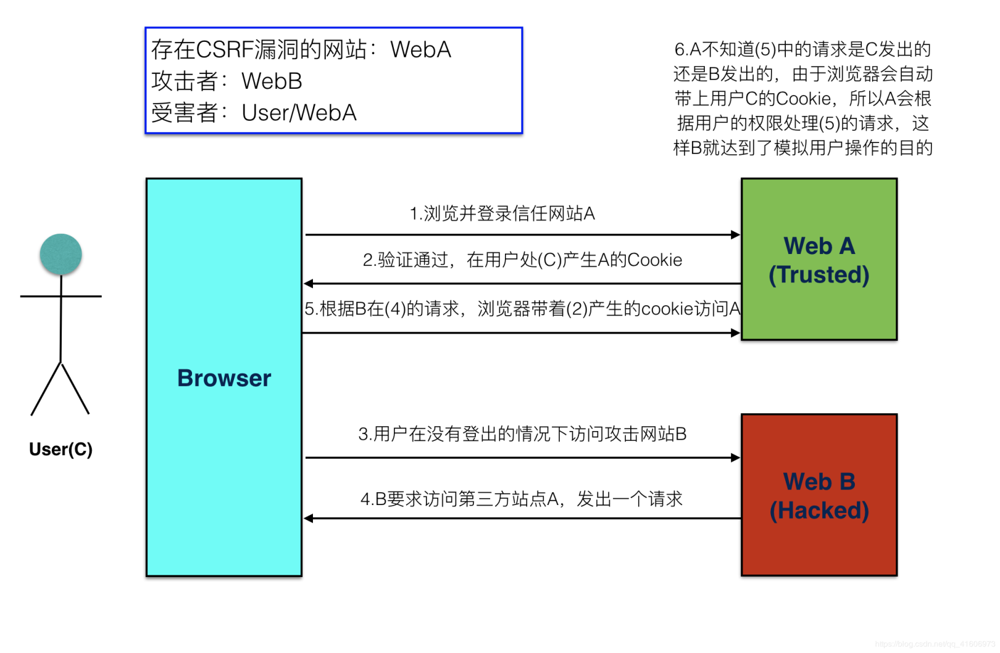

* XSS (Cross-Site Scripting)

  Let's first take a look at the following 2 codes:

  ```html
  <!-- original html code -->
  <body>
    	<h>Test</h>
  </body>
  ```

  ```html
  <!-- hacked html code -->
  <body>
    <h>Test</h><script>alert('This code is injected!')</script><h></h>
  </body>
  ```

  Suppose somebody injected a piece of code inside a form or something else, when the users visit this site, the code will run at once, and the hackers might be able to access the user's private information including usernames and passwords.

  Hackers just have to insert `</h><script>alert('This code is injected!')</script><h>` after 'Test'

  1. Encode response data

     Everything which is supposed to be plain text should be encoded in the following way so that they cannot be executed as script but can be displayed normally

     ```html
     <!-- convert: -->
     Test</h><script>alert('This code is injected!')</script><h>
       
     <!-- to: -->
     Test&lt;/h&gt;&lt;script&gt;alert('This code is injected!')&lt;/script&gt;<h>
     ```

  2. Limit form input length

* CSRF (Cross-Site Request Forgery)

  Take use of other user's verification, and visit some websites with their browser

  

  * Prerequisites of CSRF

    1. User C has logged in Website A and generated `cookie` locally
    2. User C visits **Hacked** Website B without logging out at Website A

  * Defending Methods

    1. Check request source
       * `referer` header
       * `origin` header
    2. Verify `token`
       * add `token` to the request after submitting the form, verify `token` in back-end
       * carry `token` in every request
         * front-end access token from the web app or `cookie`
         * back-end verify the received `token` with the `token` stored in its `cookie`

  * axios code

    ```JavaScript
    // xsrfCookieName is the name of the cookie to use as a value for xsrf token
    xsrfCookieName: 'XSRF-TOKEN', // default
    
    // xsrfHeaderName is the name of the http header that carries the xsrf token value
    xsrfHeaderName: 'X-XSRF-TOKEN', // default
    
    // set these fields in an `axios` request to apply XSRF-TOKEN
    ```

* SSRF

  When accessing an internal website which is not supposed to be available by external users, external users can bypass this limit by visiting an internal server which can access the internal website.

  * 4 types of attacks:
    * scan port information on external network, internal network and local server to acquire some `Banner` information
    * attack some applications running on internal network or local server (buffer overflow)
    * get fingerprint recognition of internal network applications by visiting default files
    * read local server files with `file` protocol

  * Defending Methods

    * Ban unnecessary protocols

      * check if output type matches expected type
      * filter requests to private internal IP

    * Preventing short circuit

      **However**, hackers can bypass the filter with `short circuit`, they first visit the other website and jump fto the real server with a 302 redirect

      * check internal IP with the `host` field in redirect response header
      * check internal IP every time after DNS, since 302 redirect will also require a DNS
      * forbid redirects

    * Preventing DNS re-bound attack

      Hackers can even upload a short-living `(domain, IP)` pair to the DNS server,  so that different DNS request might response with different IP addresses

      * merge multiple DNS requests, use the IP from the 1st response to prevent the 2nd request
      * check response IP when requesting a `GET`, if invalid, drop the request

* DDoS


### Reference

XSS:

https://www.jianshu.com/p/c2877d36d279

CSRF:

https://cloud.tencent.com/developer/article/1494289

SSRF: 

https://juejin.im/post/5b95ce0df265da0acb13752c

https://juejin.im/post/5c466988f265da615f778eda