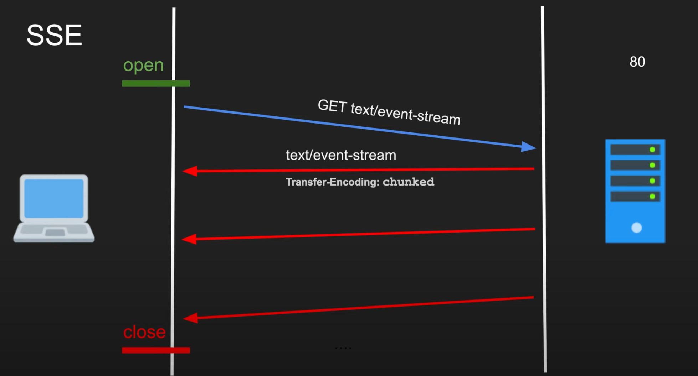
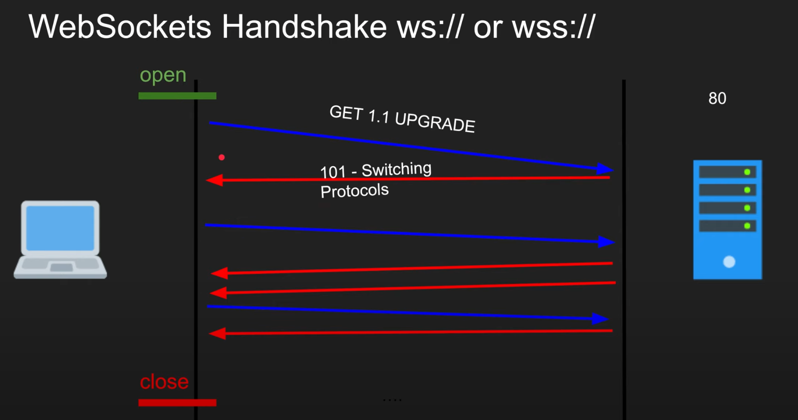

# INTRO

> Server-Sent Events (SSE) is a server push technology enabling a client to receive automatic updates from a server via an HTTP connection, and describes how servers can initiate data transmission towards clients once an initial client connection has been established. They are commonly used to send message updates or continuous data streams to a browser client and designed to enhance native, cross-browser streaming through a JavaScript API called EventSource, through which a client requests a particular URL in order to receive an event stream. The Server-Sent Events EventSource API is standardized as part of HTML5 by the W3C.

## Characteristics

-   Persistent
-   Unidirectional

## Pros/Cons

-   Pros

    -   Lightweight
    -   HTTP & HTTP/2 compatible
    -   Firewall friendly(standard)

-   Cons
    -   Proxying is tricky
    -   L7 L/B challenging (timeouts)
    -   Stateful, difficult to horizontally scale

## Common Scenarios

-   Social media status updates;
-   News feeds;
-   Delivering data into a client-side storage mechanism like IndexedDB or web storage.

# PRACTICE

Let's see how to use the `EventSource` API.
Add the following file in a live server.

```js
// js/eventsource.js
const source = new EventSource("http://localhost:8080/stream");

// new connection opened callback
source.addEventListener(
    "open",
    function (e) {
        console.log("connection opened: ", e);
    },
    false
);

// subscribe to unnamed messages
source.onmessage = function (e) {
    console.log("receiving msg: ", e);
};

// listen for signup events
source.addEventListener(
    "signup",
    function (e) {
        console.log("new event: ", e);
    },
    false
);

// connection closed callback
source.addEventListener(
    "error",
    function (e) {
        if (e.eventPhase == EventSource.CLOSED) {
            console.log("connection closed: ", e);
        }
    },
    false
);
```

Run the following script with nodejs

```js
// server/eventsource.js
const express = require("express");
const cors = require("cors");

const app = express();
app.use(cors());

app.get("/", (req, res) => res.send("hello!"));
app.get("/stream", (req, res) => {
    res.setHeader("Content-Type", "text/event-stream");
    setInterval(() => send(res), 1000);
});

function send(res) {
    res.write("data: " + "hello world event source\n\n");
}

app.listen(8080);
console.log("Listening on 8080");
```

```bash
# run the command to activate the server
node server/eventsource.js
```

# BENCHMARKING




# REFERENCE

-   wiki: https://en.wikipedia.org/wiki/Server-sent_events
-   mdn: https://developer.mozilla.org/en-US/docs/Web/API/EventSource
-   demo: https://gist.github.com/andy12530/3943467
-   youtube walkthrough: https://www.youtube.com/watch?v=4HlNv1qpZFY
