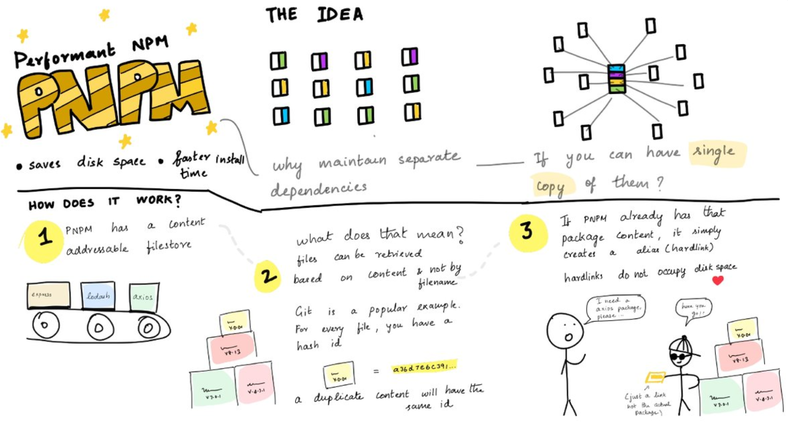
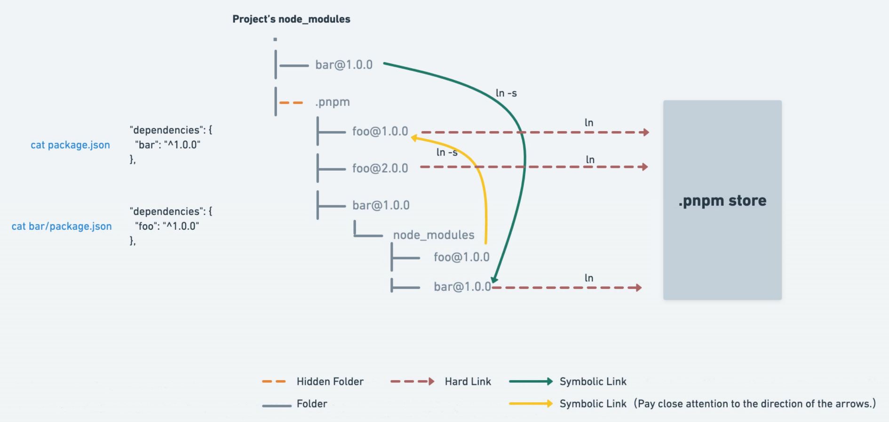

# INTRO

pnpm = performant npm

bookmark: https://pnpm.io/scripts

## WHY PNPM

-   saves disk space
-   faster install time
-   solves `phantom dependency` and `npm doppelgangers` problems

## MAIN IDEA

1. `single content-addressable storage` vs `copy of dependencies`



2. `non-flat node_modules` vs `flat node_modules`



## CLI

|               |                 |                 |
| ------------- | --------------- | --------------- |
| npm command   | yarn equivalent | pnpm equivalent |
| npm install   | yarn install    | pnpm install    |
| npm i <pkg>   | yarn add <pkg>  | pnpm add <pkg>  |
| npm run <cmd> | yarn <cmd>      | pnpm <cmd>      |

```bash
# same as npx create-react-app my-project
pnpx create-react-app my-project

# set pnpm store directory
pnpm config set store-dir /path/to/.pnpm-store

# filtering
pnpm --filter <package-name> <command>
# e.g.: run test only for `hello-world`
pnpm --filter hello-world test


```

# REFERENCE

-   pnpm + monorepo: https://juejin.cn/post/6972139870231724045
-   phantom dep & doppelgangers: https://zhuanlan.zhihu.com/p/353208988
-   npm vs pnpm vs yarn: https://rushjs.io/pages/maintainer/package_managers/
