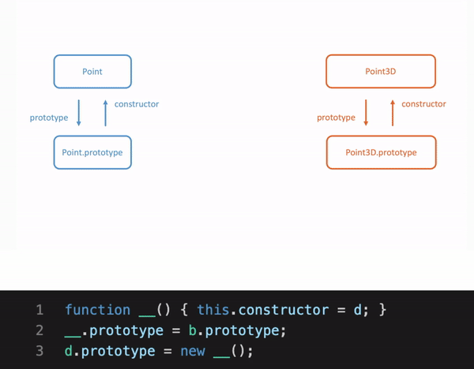

# Classes Emit

IIFE(Immediately-Invoked Function Expression)

## Why IIFE?

```typescript
// point.ts
class Point {
    x: number;
    y: number;
    constructor(x: number, y: number) {
        this.x = x;
        this.y = y;
    }
    add(point: Point) {
        return new Point(this.x + point.x, this.y + point.y);
    }
}
```
Notice that the compiled js code is wrapped in an `IIFE`
```js
// point.js
var Point = /** @class */ (function () {
    function Point(x, y) {
        this.x = x;
        this.y = y;
    }
    Point.prototype.add = function (point) {
        return new Point(this.x + point.x, this.y + point.y);
    };
    return Point;
}());
```

`IIFE` allows `TypeScript` to capture the base class as a variable `_super`

```typescript
// point3D.ts
class Point {
    x: number;
    y: number;
    constructor(x: number, y: number) {
        this.x = x;
        this.y = y;
    }
    add(point: Point) {
        return new Point(this.x + point.x, this.y + point.y);
    }
}

class Point3D extends Point {
    z: number;
    constructor(x: number, y: number, z: number) {
        super(x, y); // call the parent constructor
        this.z = z;
    }
    add(point: Point3D) {
        var point2D = super.add(point);
        return new Point3D(point2D.x, point2D.y, this.z + point.z);
    }
}
```

```js
// point3D.js
var __extends = (this && this.__extends) || (function () {
    var extendStatics = function (d, b) {
        extendStatics = Object.setPrototypeOf ||
            ({ __proto__: [] } instanceof Array && function (d, b) { d.__proto__ = b; }) ||
            function (d, b) { for (var p in b) if (b.hasOwnProperty(p)) d[p] = b[p]; };
        return extendStatics(d, b);
    };
    return function (d, b) {
        extendStatics(d, b);
        function __() { this.constructor = d; }
        d.prototype = b === null ? Object.create(b) : (__.prototype = b.prototype, new __());
    };
})();

var Point = /** @class */ (function () {
    function Point(x, y) {
        this.x = x;
        this.y = y;
    }
    Point.prototype.add = function (point) {
        return new Point(this.x + point.x, this.y + point.y);
    };
    return Point;
}());

var Point3D = /** @class */ (function (_super) {
    __extends(Point3D, _super);
    function Point3D(x, y, z) {
        var _this = _super.call(this, x, y) || this;
        _this.z = z;
        return _this;
    }
    Point3D.prototype.add = function (point) {
        var point2D = _super.prototype.add.call(this, point);
        return new Point3D(point2D.x, point2D.y, this.z + point.z);
    };
    return Point3D;
}(Point));
```

Q: Any other alternatives to IIFE in this scenario?


## __extends in depth

`TypeScript` also generates the following function:

```js
var __extends = this.__extends || function (d, b) {
    for (var p in b) if (b.hasOwnProperty(p)) d[p] = b[p];
    function __() { this.constructor = d; }
    __.prototype = b.prototype;
    d.prototype = new __();
};
```

- `d`: derived class
- `b`: base class

This function does 2 things:

1. copies the static members of the base class onto the child class:

   ```js
   for (var p in b) if (b.hasOwnProperty(p)) d[p] = b[p];
   ```

2. sets up the child class function's prototype to optionally lookup members on the parent's `proto` i.e. effectively

   ```js
   d.prototype.__proto__ = b.prototype
   ```

4 things about `Prototypal Inheritance`

- `__proto__`

  ```js
  var foo = {}
  
  // setup on foo as well as foo.__proto__
  foo.bar = 123;
  foo.__proto__.bar = 456;
  
  console.log(foo.bar); // 123
  delete foo.bar; // remove from object
  console.log(foo.bar); // 456
  delete foo.__proto__.bar; // remove from foo.__proto__
  console.log(foo.bar); // undefined
  ```

- `prototype`

  ```js
  function Foo() { }
  console.log(Foo.prototype); // {} i.e. it exists and is not undefined
  console.log(Foo.prototype.constructor === Foo); // Has a member called `constructor` pointing back to the function
  ```

- effect of `new` on `this` inside the called function

  ```js
  function Foo() {
  		this.bar = 123;
  }
  
  // call with the new operator
  var newFoo = new Foo();
  console.log(newFoo.bar); // 123
  newFoo.bar = 456;
  console.log(newFoo.bar); // 456
  ```

- effect of `new` on `prototype` and `__proto__`

  ```js
  function Foo() { }		// constructor function
  
  var foo = new Foo();	// `new` operator
  
  console.log(foo.__proto__ === Foo.prototype); // True!
  ```

Now look at what happened in `__extends`

```js
1 function __() { this.constructor = d; }
2 __.prototype = b.prototype;
3 d.prototype = new __();
```

Eventually we want:

d.prototype.\__proto__ === b.prototype

We now have:

```js
function __() { this.constructor = d; }
// => maintain the old constructor d
```

```js
__.prototype = b.prototype;
```

```js
d.prototype = new __();
// =>  d.prototype.__proto__ === __.prototype
// and __.prototype === b.prototype
// =>  d.prototype.__proto__ === b.prototype
```

**Note: What if we remove the 1st line?**

```js
// with 1st line
var __extends =
    this.__extends ||
    function (d, b) {
        for (var p in b) if (b.hasOwnProperty(p)) d[p] = b[p];
        function __() {
          	this.constructor = d;
        }
        __.prototype = b.prototype;
        d.prototype = new __();
		};
var Point = /** @class */ (function () {
    function Point(x, y) {
        this.x = x;
        this.y = y;
    }
    Point.prototype.add = function (point) {
     	 return new Point(this.x + point.x, this.y + point.y);
    };
    return Point;
})();
var Point3D = /** @class */ (function (_super) {
    __extends(Point3D, _super);
    function Point3D(x, y, z) {
        var _this = _super.call(this, x, y) || this;
        _this.z = z;
        return _this;
    }
    Point3D.prototype.add = function (point) {
      	var point2D = _super.prototype.add.call(this, point);
      	return new Point3D(point2D.x, point2D.y, this.z + point.z);
    };
    return Point3D;
})(Point);
let point1 = new Point3D(1, 2, 3);
console.log(point1.x, point1.y, point1.z); 	// 1 2 3
console.log(point1.constructor);						// [Function: Point3D]
```

```js
// without 1st line
var __extends =
    this.__extends ||
    function (d, b) {
        for (var p in b) if (b.hasOwnProperty(p)) d[p] = b[p];
        function __() {
            // this.constructor = d; // <-- comment 1st line
        }
        __.prototype = b.prototype;
        d.prototype = new __();
};
// ...
let point1 = new Point3D(1, 2, 3);
console.log(point1.x, point1.y, point1.z); 	// 1 2 3
console.log(point1.constructor);						// [Function: Point]
```

We can observe that the constructor of point1 becomes `Point` instead of `Point3D`

This is because the assignment of `prototype` would override `constructor` as well if no other `constructor` is present in the object accepting the assignment.

```js
var __extends =
    this.__extends ||
    function (d, b) {
        for (var p in b) if (b.hasOwnProperty(p)) d[p] = b[p];
        function __() {
            // this.constructor = d; // <-- commented 1st line
        }
        __.prototype = b.prototype; // override __'s default constructor from b
        d.prototype = new __();			// override d's default constructor from __
};
```

See details here with these codes:

```js
var __extends =
    this.__extends ||
    function (d, b) {
        for (var p in b) if (b.hasOwnProperty(p)) d[p] = b[p];
        function __() {
          	// this.constructor = d;
        }
        console.log("here1", __.prototype.constructor); // [Function: __]
        __.prototype = b.prototype;
        console.log("here2", __.prototype.constructor); // [Function: Point]
        console.log("here3", d.prototype.constructor);  // [Function: Point3D]
        d.prototype = new __();
        console.log("here4", d.prototype.constructor);  // [Function: Point]
};
// ...
```

## Prototype Chain

</img>


