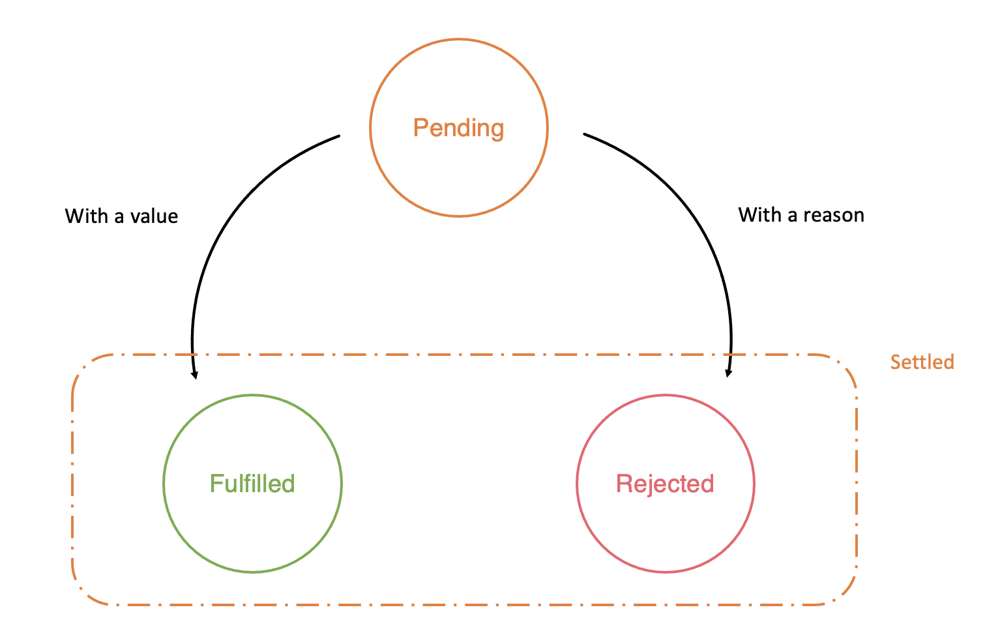

# Promise

The main motivation: bring synchronous style error handling to Async / Callback style code.

## Callback style code

Synchronous version of loading JSON file

```js
import fs = require('fs');

function loadJSONSync(filename: string) {
    return JSON.parse(fs.readFileSync(filename));
}

// good json file
console.log(loadJSONSync('good.json'));

// non-existent file, so fs.readFileSync fails
try {
    console.log(loadJSONSync('absent.json'));
}
catch (err) {
    console.log('absent.json error', err.message);
}

// invalid json file i.e. the file exists but contains invalid JSON so JSON.parse fails
try {
    console.log(loadJSONSync('invalid.json'));
}
catch (err) {
    console.log('invalid.json error', err.message);
}
```

Async version:

```js
import fs = require('fs');

// A decent initial attempt .... but not correct. We explain the reasons below
function loadJSON(filename: string, cb: (error: Error, data: any) => void) {
    fs.readFile(filename, function (err, data) {
        if (err) cb(err);
        else cb(null, JSON.parse(data));
    });
}
```

A few points to keep in mind when working with `async` functions:

- Never call the callback twice
- Never throw an error

The function above failed to accomodate the 2nd point, since `JSON.parse` would throw an error if it is passde bas JSON and the callback will never get called.

```js
import fs = require('fs');

// A decent initial attempt .... but not correct
function loadJSON(filename: string, cb: (error: Error, data: any) => void) {
    fs.readFile(filename, function (err, data) {
        if (err) cb(err);
        else cb(null, JSON.parse(data)); // throws error on passing args
    });
}

// load invalid json
loadJSON('invalid.json', function (err, data) {
    // This code never executes
    if (err) console.log('bad.json error', err.message);
    else console.log(data);
});
```

To resolve this, wrap in a try / catch block:

```js
import fs = require('fs');

// A better attempt ... but still not correct
function loadJSON(filename: string, cb: (error: Error) => void) {
    fs.readFile(filename, function (err, data) {
        if (err) {
            cb(err);
        }
        else {
            try {
                cb(null, JSON.parse(data));
            }
            catch (err) {
                cb(err);
            }
        }
    });
}

// load invalid json
loadJSON('invalid.json', function (err, data) {
    if (err) console.log('bad.json error', err.message);
    else console.log(data);
});
```

There's still a subtle bug.

If the callback (`cb`), not `JSON.parse`, throws an error, since we wrapped it in a `try` / `catch`,  the `catch` executes and we call the callback again i.e. the callback gets called twice!

```js
import fs = require('fs');

function loadJSON(filename: string, cb: (error: Error) => void) {
    fs.readFile(filename, function (err, data) {
        if (err) {
            cb(err);
        }
        else {
            try {
                cb(null, JSON.parse(data));
            }
            catch (err) {
                cb(err);
            }
        }
    });
}

// a good file but a bad callback ... gets called again!
loadJSON('good.json', function (err, data) {
    console.log('our callback called');

    if (err) console.log('Error:', err.message);
    else {
        // let's simulate an error by trying to access a property on an undefined variable
        var foo;
        // The following code throws `Error: Cannot read property 'bar' of undefined`
        console.log(foo.bar);
    }
});
```

 ```bash
$ node asyncbadcatchdemo.js
our callback called
our callback called
Error: Cannot read property 'bar' of undefined
 ```

**Lesson**: Contain all your sync code in a try catch, except when you call the callback

Fully functional async version of `loadJSON`:

```js
import fs = require('fs');

function loadJSON(filename: string, cb: (error: Error) => void) {
    fs.readFile(filename, function (err, data) {
        if (err) return cb(err);
        // Contain all your sync code in a try catch
        try {
            var parsed = JSON.parse(data);
        }
        catch (err) {
            return cb(err);
        }
        // except when you call the callback
        return cb(null, parsed);
    });
}
```

## Promise style code

A promise can be either `pending` or `fulfilled` or `rejected`



**Note**: the following 3 sections are taken from `demonic`'s [github](https://github.com/domenic/promises-unwrapping/blob/master/docs/states-and-fates.md#:~:text=Promises%20have%20two%20possible%20mutually,has%20been%20fulfilled%20or%20rejected.).

### States

Promises have three possible mutually exclusive states: fulfilled, rejected, and pending.

- A promise is *fulfilled* if `promise.then(f)` will call `f` "as soon as possible."
- A promise is *rejected* if `promise.then(undefined, r)` will call `r` "as soon as possible."
- A promise is *pending* if it is neither fulfilled nor rejected.

We say that a promise is *settled* if it is not pending, i.e. if it is either fulfilled or rejected. Being settled is not a state, just a linguistic convenience.

### Fates

Promises have two possible mutually exclusive fates: resolved, and unresolved.

- A promise is *resolved* if trying to resolve or reject it has no effect, i.e. the promise has been "locked in" to either follow another promise, or has been fulfilled or rejected.
- A promise is *unresolved* if it is not resolved, i.e. if trying to resolve or reject it will have an impact on the promise.

A promise can be "resolved to" either a promise or thenable, in which case it will store the promise or thenable for later unwrapping; or it can be resolved to a non-promise value, in which case it is fulfilled with that value.

### Relating States and Fates

A promise whose fate is resolved can be in any of the three states:

- Fulfilled, if it has been resolved to a non-promise value, or resolved to a thenable which will call any passed fulfillment handler back as soon as possible, or resolved to another promise that is fulfilled.
- Rejected, if it has been rejected directly, or resolved to a thenable which will call any passed rejection handler back as soon as possible, or resolved to another promise that is rejected.
- Pending, if it has been resolved to a thenable which will call neither handler back as soon as possible, or resolved to another promise that is pending.

A promise whose fate is unresolved is necessarily pending.

Note that these relations are recursive, e.g. a promise that has been resolved to a thenable which will call its fulfillment handler with a promise that has been rejected is itself rejected.

**Q**: what does it mean by `it has been resolved to a thenable which will call neither handler back as soon as possible`

### Promise Constructor

```js
const promise = new Promise((resolve, reject) => {
    // the resolve / reject functions control the fate of the promise
});
```


## Reference

https://github.com/domenic/promises-unwrapping/blob/master/docs/states-and-fates.md#:~:text=Promises%20have%20two%20possible%20mutually,has%20been%20fulfilled%20or%20rejected.