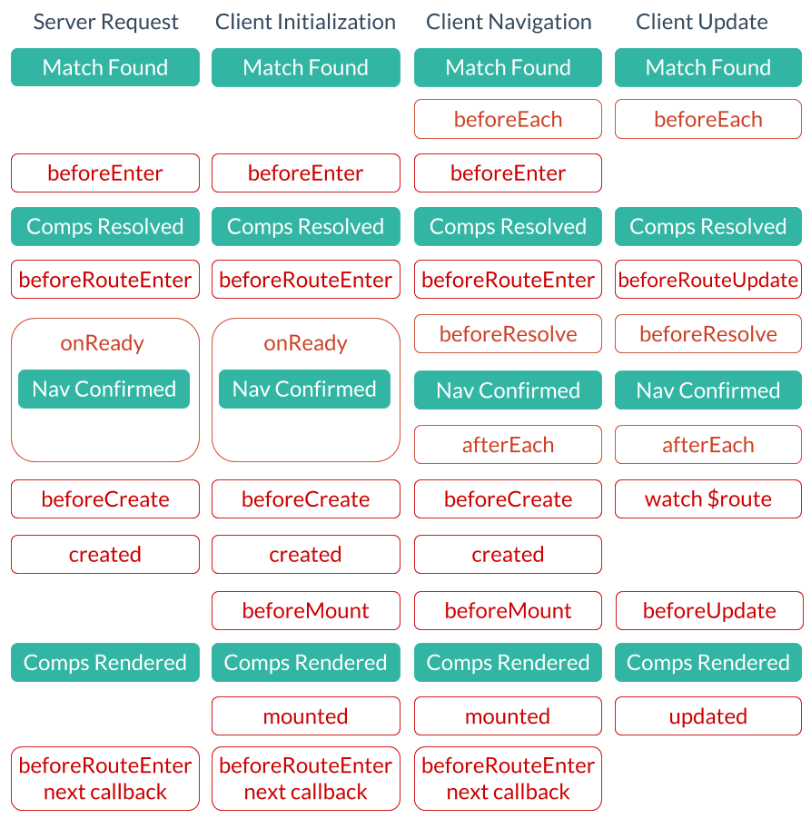

# Vue Interview Problems

1. SPA vs MPA

||SPA|MPA|
|---|---|---|
|Concept|The whole application has only 1 page, static assets like `js` and `css` will be only loaded at the beginning. Page routing is just local resource refreshing.|The app has multiple pages, every single page has to load `js` and `css` once. Page routing requires to refresh the whole page.|
|Scenarios|Speed-sensitive products, low requirement in SEO|SEO-sensitive apps|
|Pros|Fast Page Switching<br />Page Transition animation easy to implement<br />|SEO friendly|
|Cons|Optimization required when there're massive static assets<br />|Slow Page Switching<br />Redundant shared asset loading<br />Repeated HTTP requests|

2. MVX

* MVVM

  View <-> ViewModel <-> Model

  `ViewModel` is the core, it is syncing the `View` while interacting with the `Model`

  * Pros
    1. [Two-way data binding](./Two%20way%20Data%20Binding.md), DOM's are automatically updated so that developers don't have to do this any more
    2. Reusability
  * Cons
    1. Hard to debug since everything is synced
    2. Massive `Model` makes great RAM consumption

* MVC

3. `v-if` vs `v-show`

   |`v-if`|`v-show`|
   |---|---|
   |if false, this element will not be rendered at all|if false, this element will still be rendered, but its `display` property will be set to `none`|

4. why `data` is a function in Vue

    if `data` is an object instead of a function, all instances of this Vue component will share the reference to this object. 

   if `data()` is a function, then every instantiation will call `data()` and return a brand new copy of the object.

5. `computed` vs `watch` vs `methods`

   ||Description|
   |---|---|
   |computed|`computed` properties are **cached** based on their reactive dependencies|
   |watch|`watch` is most useful when you want to perform `asynchronous` or expensive operations in response to changing data|
   |methods|a `method` invocation will **always** run the function whenever a re-render happens|
   
   Note: 
   
   ​		`computed`  properties are by default getter-only, but you can also provide a setter when you need it
   
6. Vue Lifecycle

   

   When can users operate DOM elements? 

   `mounted` and `updated`

7. Vue cross-component communication

   |Component Relationship|Method|
   |---|---|
   |Parent -> Son|Parent component pass a `prop` to child component<br />Child component accepts it in its `props` object|
   |Son -> Parent|Child component call this.$emit('event', data) to trigger an event on parent component|
   |Parent <-> Son|`$parent` and `$children`|
   |Parent <-> Son|`$ref`|
   |Any|`eventBus`<br />Create an empty Vue instance, use it as a event bus, senders `emit` events to it, and receivers listen to events on it|
   |Any|`Vuex`, centralized state management solution<br />Sometimes we can use localStorage to maintain vuex states after a refresh|
   |Nested|`$attrs` and `$listeners`|
   |Nested|`provide` and `inject`|
   

   Note:

   Here, when we say parent component and child component, we are actually talking about the instance component and the abstract component:

   ```jsx
   // parent.vue
   <template>
       <div id="app">
         	<!-- instance component -->
           <myComponent v-on:titleChanged="updateTitle"></myComponent>
           <h2>{{ title }}</h2>
       </div>
   </template>
   // ...
   
   // child.vue
   // abstract component
   <template>
   		<header>
       		<h1 @click="changeTitle">{{title}}</h1>
     	</header>
   </template>
   // ...
   ```

   

8. `keep-alive` component

   https://juejin.im/post/5b407c2a6fb9a04fa91bcf0d

9. Vue detect updates in Array or Object

   For the benefit of performance, Vue does not want to walk through the whole Array or Object to check for updates, if we do use Object.defineProperty() to alter the `get` and `set` methods of an Object, we actually have the chance to capture the update of Array and Object.

10. What does `key` directive do in Vue?

    `key` is mainly used for Vue's virtual DOM algorithm as a recognizer of VNode when applying diff on new node list and old node list.

    * Scenario 1: Support `v-for` directive

      ```jsx
      <div :key="idx" v-for="(item, idx) in items"></div>
      ```

    * Scenario 2: Manually trigger re-render

      ```jsx
      <div :key="timeStamp">
          <span>Hello Vue.js !</span>
          <complexComponent :propObj="propObj" :propArr="propArr" ></complexComponent>
      </div>
      
      refresh() {
          this.timeStamp = + new Date();
      }
      ```
    
    Note: 
    
    * If `key` is not used, Vue will use this algorithm: Minimize element displacement and try best to do patch / reuse for elements of the same type at appropriate places
    * If `key` is used, Vue will record elements according to `keys`, if an element which possessed a key does not occur, it will be removed / destroyed
    * We can also call vm.$forceUpdate() to manually update the component
    
11. Principle of `nextTick`

    Demand: 

    Defer the callback to be executed after the next DOM update cycle. Use it immediately after you’ve changed some data to wait for the DOM update.

    ```jsx
    // modify data
    vm.msg = 'Hello'
    // DOM not updated yet
    Vue.nextTick(function () {
      	// DOM updated
    })
    
    // usage as a promise (2.1.0+, see note below)
    Vue.nextTick()
        .then(function () {
          	// DOM updated
        })
    ```

    The principle is to make it a microtask when we can, and make it a macrotask if microtask is not supported.

    According to HTML standard, UI render happens right after an event loop and before the next event loop.

    When the DOM is modified by some JS code, 

    ​	if nextTick is implemented with Promise, it will be a microtask and thus executed on time before UI render.

    ​	if nextTick is implemented with setTimeout, it will be a macrotask and thus executed after UI render. And if the callback of nextTick is altering DOM as well, users should be able to see the change in the next UI render.

12. Vuex

    

    * What is Vuex

      A centralized storage management plugin, the only way to alter state is to `commit` a `mutation`

    * 5 core concepts in Vuex

      `state`, `getters`, `mutations`, `actions`, `modules`

    * When to use Vuex?
    
  * multiple components are dependent on a same state
      * different behaviors are trying to modify the same state

    * What is a state is a complex type variable

      When we are trying to copy the state and modify it, it will alter the original state as well since the copy is referencing the original data. So we should deepcopy the object and modify it afterward.

    * How to extend existing states and create computed states?

      `getters` can do this trick

      a `getter` has 2 arguments, the 1st one is the state for us to access all states, the 2nd one is the getters for us to access other getters
    
      ```jsx
      const store = new Vuex.Store({
          state: {
              price: 10,
              number: 10,
              discount: 0.7,
          },
          getters: {
              total: state => {
                  return state.price * state.number
              },
              discountTotal: (state, getters) => {
                  return state.discount * getters.total
              }
          },
      });
      ```
    
    * What is the difference between `mutations` and `actions`?
    
      `mutations` are synchronous
    
      `actions` can contain any asynchronous operations
    
      `action` is commiting a `mutation` asynchronously instead of altering the state itself.
    
      1st argument of an `action` is the `context` which consists of:
    
      ```jsx
      {
          state,      // 等同于 `store.state`，若在模块中则为局部状态
          rootState,  // 等同于 `store.state`，只存在于模块中
          commit,     // 等同于 `store.commit`
          dispatch,   // 等同于 `store.dispatch`
          getters,    // 等同于 `store.getters`
          rootGetters // 等同于 `store.getters`，只存在于模块中
      }
      ```
      2nd argument of an `action` is the data to be updated
    
      ```jsx
      const actions = {
          async alterData({ commit }, data) {
              commit("updateData", data);
          },
      };
      
      const mutations = {
        	updateData: (state, data) => {
            	state.data = data;
          }
      }
      ```
    
    * What are `modules`?
    
      `modules` are used to decentralized states into different modules so that they can be more managable
      
    * Is there an individual namespace for a `module`?
    
      Use `namespaces: true` to enable a namespace
    
      ```jsx
      export default {
          namespaced: true,
          state,
          getters,
          mutations,
          actions
      }
      ```
    
    * What is `strict mode` in Vuex?
    
      ```jsx
      const store = new Vuex.Store({
          strict: true,
      })
      ```
    
      It guarantees that every single state update not triggered by `mutation` will result in an Error so that every state update can be tracked by debugger.
    
13. Vue-Router

    * 2 types of routers
    * lifecycle hooks
      * global
      * individial
      * internal

    

### Reference

https://juejin.im/post/5dd23a34f265da0be14f7035

https://juejin.im/post/5dbbecadf265da4d1d32f575

https://juejin.im/entry/5aced80b518825482e39441e

https://juejin.im/post/5dba91e4518825647e4ef18b

https://juejin.im/post/5d9c43b751882507b40d3376

https://zhuanlan.zhihu.com/p/54112006

https://juejin.im/post/5cde0b43f265da03867e78d3

https://juejin.im/post/5d267dcdf265da1b957081a3