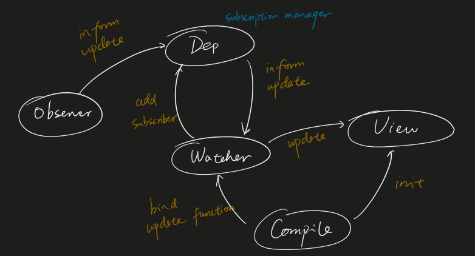

# Vue Two-way Data Binding

## 0. What is Vue two-way data binding

* One-way data binding: bind a JS variable to the DOM
* Two-way data binding: data is also bound from the DOM back to JS


## 1. Where do we use two-way data binding


## 2. How to apply two-way data binding

### Two-way data binding with jQuery

* create an event listener to watch the updates of the DOM element
* pass whatever the newly updated data to JS variable

### Code

```HTML
<input id="input" type="text" />
<br />
This is the message: <span id="output"></span>
```

```JavaScript
var $input = $("#input");
var $output = $("#output");

// A controller for getting/setting the bound variable
var message = {
    /*
    content: null,				
    get: function() {
      	return this.content;
    },
    */
    set: function(val) {
        //this.content = val;
        $output.html(val); 	// from JS to DOM
        $input.val(val);		// pre-fill the input with initial DOM innerHTML 
    },
};
// Listens for changes in input
$input.on("keyup", function() {
  	message.set($(this).val());		// from DOM to JS
});
message.set("jQuery data binding is far less sexy.");
```

### Two-way data binding with Vue


Simplest example: 

```HTML
<div id="app-6">
    <p>{{ message }}</p>
    <!-- v-model alone can do two-way data binding -->
    <input v-model="message">	
</div>
```

```JavaScript
var app6 = new Vue({
    el: '#app-6',
    data: {
      	message: 'Hello Vue!'
    }
})
```

But two-way data binding won't work by default when the parent component passed a prop into child component and child would like to update the data, since it's impossible for Vue to track the source of the update.

From parent to child component (before Vue 2.3.0)

```Vue
<!-- inside parent component -->
<SampleComponent :inputData="parentData" @update="parentData = $event;" />

<!-- inside child component -->
<template>
    <div>
        <input type="text" v-model="inputData" @keyup="$emit('update', inputData);" />
    </div>
</template>
<script>
export default {
    name: "HelloWorld",
    props: {
        inputData: String
    }
};
</script>
```

From parent to child component (after Vue 2.3.0): [DEMO](https://codesandbox.io/s/218m3mloj?file=/src/App.vue)

```Vue
<!-- inside parent component -->
<SampleComponent :inputData.sync="parentData" />

<!-- inside child component -->
<template>
    <div>
        <input type="text" v-model="inputData" @keyup="$emit('update:inputData', inputData);"/>
    </div>
</template>
<script>
export default {
    name: "HelloWorld",
    props: {
        inputData: String
    }
};
</script>
```
## 3. Principles of two-way data binding

2 parts:

* Data Hijacking
* Publish-Subscribe Mode

### What on earth is the data in Vue component?

```JavaScript
var vm = new Vue({
    data: {
        obj: {
            a: 1
        }
    },
    created: function () {
        console.log(this.obj);
    }
});
```

```console
{__ob__: Observer}
    a: (...)
    __ob__: Observer {value: {…}, dep: Dep, vmCount: 0}
    get a: ƒ reactiveGetter()
    set a: ƒ reactiveSetter(newVal)
    __proto__: Object
```

Notice that attribute "a" of the object keeps 2 methods: "get" and "set".

Vue is using Object.defineProperty() to override the get and set attributes to implement the data hijack.

See an example of overriding these attributes with Object.defineProperty()

```JavaScript
var Book = {}
var name = '';
Object.defineProperty(Book, 'name', {
    set: function (value) {
        name = value;
        console.log('You named a book: ' + value);
    },
    get: function () {
      	return '《' + name + '》'
    }
})
 
Book.name = 'vue guide';  // You named a book: vue guide
console.log(Book.name);  // 《vue guide》
```


## 4. A custom simple two-way data binding implementation

We know that two-way data binding is composed of two kinds of updates: view can update data while data can update view as well.

Update from view to data can be trivially done by event listening, but how do we update from data to view?

We use "set" attribute.

Since "set" attribute would be called every time the data is updated, we just have to add some methods to update the view accordingly inside the setter function.



### Step 1: Observer

If we would like to listen to any attribute (including nested attributes) of an object, we should recursively override setters with Object.defineProperty().

```JavaScript
function defineReactive(data, key, val) {
    observe(val); // recursively visit all nested attributes
    Object.defineProperty(data, key, {
        enumerable: true,
        configurable: true,
        get: function() {
            return val;
        },
        set: function(newVal) {
            val = newVal;
            console.log('Attribute ' + key + ' has been listened，curr value："' + newVal.toString() + '"');
        }
    });
}
 
function observe(data) {
  	// base case
    if (!data || typeof data !== 'object') {
        return;
    }
  	// iteratively call defineReactive with attributes of "this" data, which can also be objects
    Object.keys(data).forEach(function(key) {
        defineReactive(data, key, data[key]);
    });
};
 
var library = {
    book1: {
        name: ''
    },
    book2: ''
};
observe(library);
library.book1.name = 'vue guide';  	// Attribute name has been listened，curr value：“vue guide”
library.book2 = 'no such book';  		// Attribute book2 has been listened，curr value：“no such book”
```


### Step 2: Dep

We need a list to maintain all subscribers of an attribute. Dep is a subscriber manager.

```JavaScript
function defineReactive(data, key, val) {
    observe(val); // recursively visit all nested attributes
    var dep = new Dep(); // ??
    Object.defineProperty(data, key, {
        enumerable: true,
        configurable: true,
        get: function() {
            if (/* need to add subscriber */) {
                dep.addSub(subscriber); // add a subscriber
            }
            return val;
        },
        set: function(newVal) {
            if (val === newVal) {
                return;
            }
            val = newVal;
           	console.log('Attribute ' + key + ' has been listened，curr value："' + newVal.toString() + '"');
            dep.notify(); // inform all subscribers on update
        }
    });
}

function observe(data) {
  	// ...
};

function Dep () {
    this.subs = [];			// keep track of subscribers
}
Dep.prototype = {
    addSub: function(sub) {
        this.subs.push(sub);
    },
    notify: function() {// once an attribute is updated, call notify to update all subscribers
        this.subs.forEach(function(sub) {
            sub.update();
        });
    }
};
```


### Step 3: Subscriber

```JavaScript
// subscriber.js
function Subscriber(vm, exp, cb) {
    this.cb = cb; 						// callback
    this.vm = vm; 						// ???, it's object
    this.exp = exp; 					// ???, it's key
    this.value = this.get(); 	// add self as subscriber
}

Subscriber.prototype = {
    update: function () {
        this.run();
    },
    run: function () {
        var value = this.vm.data[this.exp];
        var oldVal = this.value;
        if (value !== oldVal) {
            this.value = value;
            this.cb.call(this.vm, value, oldVal);
        }
    },
    get: function () {
        Dep.target = this; 									// cache self (Subscriber Instance)
        var value = this.vm.data[this.exp]; // trigger get() in observer, because everytime we query data[key] in a Subscriber instance, we should add this subscriber to the corresponding dep
        Dep.target = null; 									// release self
        return value;
    },
};


// observer.js
function defineReactive(data, key, val) {
    observe(val); 													// recursively visit all nested attributes
    var dep = new Dep(); 
    Object.defineProperty(data, key, {
        enumerable: true,
        configurable: true,
        get: function() {
            if (Dep.target) {
                dep.addSub(Dep.target); 		// add a subscriber instance
            }
            return val;
        },
        set: function(newVal) {
            // ...
        }
    });
}
```

Now the complete observer looks like this:
```JavaScript
// observer.js
function defineReactive(data, key, val) {
    observe(val); 					// recursively visit all nested attributes
    var dep = new Dep(); 		// maintain all subscribers of data[key] within "this observer"
    Object.defineProperty(data, key, {
        enumerable: true,
        configurable: true,
        get: function () {
            if (Dep.target) {
                dep.addSub(Dep.target); // add a subscriber
            }
            return val;
        },
     		// whenever data[key] is updated with a different newVal, it will update val and notify all subscribers
        set: function (newVal) {
            if (val === newVal) {
                return;
            }
            val = newVal;
            console.log(
                "Attribute " +
                    key +
                    ' has been listened，curr value："' +
                    newVal.toString() +
                    '"'
            );
            dep.notify(); 							// inform all subscribers on update
        },
    });
}

function observe(data) {
    // base case
    if (!data || typeof data !== "object") {
        return;
    }
    // iteratively call defineReactive with attributes of "this" data, which can also be objects
    Object.keys(data).forEach(function (key) {
        defineReactive(data, key, data[key]);
    });
}

function Dep() {
    this.subs = []; // keep track of subscribers
}
Dep.prototype = {
  	// once data[key] is queried, observer will call addSub() to add a subscriber instance
    addSub: function (sub) {
        this.subs.push(sub);
    },
  	// once an attribute is updated, observer will call notify() to update all subscribers
    notify: function () {
        this.subs.forEach(function (sub) {
            sub.update();
        });
    },
};
```


Connect Observer and Subscriber and we have implemented a naive two-way data binding

```HTML
<body>
    <h1 id="name">{{name}}</h1>
</body>
<script src="js/observer.js"></script>
<script src="js/watcher.js"></script>
<script src="js/index.js"></script>
<script type="text/javascript">
    var ele = document.querySelector('#name');
    var selfVue = new SelfVue({
        name: 'hello world'
    }, ele, 'name');
 
    window.setTimeout(function () {
        console.log('name has been updated');
        selfVue.data.name = 'canfoo';
    }, 2000);
 
</script>
```

```JavaScript
// index.js
function SelfVue(data, el, exp) {
    this.data = data;
    observe(data);
    el.innerHTML = this.data[exp]; // init template value
    new Subscriber(this, exp, function (value) {
        el.innerHTML = value;
    });
    return this;
}
```

Once an SelfVue instance is instantiated, it does the following things:

* Establish an observer for the data
  * Instantiate dep to maintain all subscribers
  * Override "get" function of data[key] so that once we query data[key] inside a subscriber instance, we can add this subscriber instance to dep
  * Override "set" function of data[key] so that once data[key] is updated with a new value, all subscribers in dep will be notified
* Init template with data
* Instantiate a subscriber instance with a callback to modify element content
  * Override "get" function and call the "get" function on construction so that it can further call the "get" function of the observer and register itself as a subscriber of data[key]
  * Once data[key] is updated, this subscriber's update method will be called and then the callback will be called to update the element content

#### Improve on SelfVue function

So as to make our SelfVue function more like Vue, we want to use "SelfVue.name" instead of "SelfVue.data.name". We can add a proxy to the function so that whenever we visit a attribute of SelfVue, the proxy will visit the attribute of SelfVue.data for us.

```JavaScript
function SelfVue (data, el, exp) {
    var self = this;
    this.data = data;
 
    Object.keys(data).forEach(function(key) {
        self.proxyKeys(key);  			// bind proxy attributes
    });
 
    observe(data);
    el.innerHTML = this.data[exp];  // init template value
    new Subscriber(this, exp, function (value) {
        el.innerHTML = value;
    });
    return this;
}

SelfVue.prototype = {
    proxyKeys: function (key) {
        var self = this;
        Object.defineProperty(this, key, {
            enumerable: false,
            configurable: true,
            get: function proxyGetter() {
                return self.data[key];
            },
            set: function proxySetter(newVal) {
                self.data[key] = newVal;
            }
        });
    }
}
```


### Step 4: Compiler

In the previous step, we hardcoded the DOM element bound with data, but we want to parse DOM element so that our code can be versatile.

In order to implement a compiler, we have to do the following steps:

* Parse certain commands in our <template> (e.g. {{name}}), substitute Vue data and init view
* Bind corresponding update function to those nodes with certain commands, init corresponding Subscribers

In order to parse <template> , we want to get DOM elements, and deal with those elements with commands.

```JavaScript
function nodeToFragment (el) {
    var fragment = document.createDocumentFragment();
    var child = el.firstChild;
    while (child) {
        // append DOM element into fragment
        fragment.appendChild(child);
        child = el.firstChild
    }
    return fragment;
}
```

Now that we have all elements, let's say we only care about {{name}} command.

```JavaScript
// compiler.js
function compileElement (el) {
    var childNodes = el.childNodes;
    var self = this;
    [].slice.call(childNodes).forEach(function(node) {
        var reg = /\{\{(.*)\}\}/;
        var text = node.textContent;
 
        if (self.isTextNode(node) && reg.test(text)) {  // check if it has a {{}} command
            self.compileText(node, reg.exec(text)[1]);
        }
 
        if (node.childNodes && node.childNodes.length) {
            self.compileElement(node);  								// recursively walk down children nodes
        }
    });
},

function compileText (node, exp) {
    var self = this;
    var initText = this.vm[exp];
    this.updateText(node, initText);  									// init data to view
  	new Subscriber(this.vm, exp, function (value) {  		// instantiate Subscriber and bind update function
        self.updateText(node, value);
    });
},
  
function updateText (node, value) {
    node.textContent = typeof value == 'undefined' ? '' : value;
}
```

Now that we have finished Parse - Initialize - Compile, we get a working Compiler. See the complete compiler.js code at the end.

In order to connect Compiler, Observer and Subscriber, we need to further modify our SelfVue function.

Then we won't have to pass a fixed value to fulfill two-way data binding like we did before, we let the compiler handle that since it will parse the element and create a subscriber for any commands that match our regex.

```JavaScript
// index.js
function SelfVue (options) {
    var self = this;
    this.vm = this;
    this.data = options;
 
    Object.keys(this.data).forEach(function(key) {
        self.proxyKeys(key);
    });
 
    observe(this.data);
  	/* manual subscription
  	el.innerHTML = this.data[exp]; // init template value
    new Subscriber(this, exp, function (value) {
        el.innerHTML = value;
    });
  	*/
  	
  	// subscription with compiler
    new Compile(options, this.vm);
    return this;
}
```

```HTML
<body>
    <div id="app">
        <h2>{{title}}</h2>
        <h1>{{name}}</h1>
    </div>
</body>
<script src="js/observer.js"></script>
<script src="js/subscriber.js"></script>
<script src="js/compile.js"></script>
<script src="js/index.js"></script>
<script type="text/javascript">
 
    var selfVue = new SelfVue({
        el: '#app',
        data: {
            title: 'hello world',
            name: ''
        }
    });
 
    window.setTimeout(function () {
        selfVue.title = 'Bonjour';
    }, 2000);
 
    window.setTimeout(function () {
        selfVue.name = 'canfoo';
    }, 2500);
 
</script>
```

```JavaScript
function Compile(el, vm) {
    this.vm = vm;
    this.el = document.querySelector(el);
    this.fragment = null;
    this.init();
}

Compile.prototype = {
    init: function () {
        if (this.el) {
            this.fragment = this.nodeToFragment(this.el);
            this.compileElement(this.fragment);
            this.el.appendChild(this.fragment);
        } else {
            console.log('Dom element not exist');
        }
    },
    nodeToFragment: function (el) {
        var fragment = document.createDocumentFragment();
        var child = el.firstChild;
        while (child) {
            // append DOM element into fragment
            fragment.appendChild(child);
            child = el.firstChild
        }
        return fragment;
    },
    compileElement: function (el) {
        var childNodes = el.childNodes;
        var self = this;
        [].slice.call(childNodes).forEach(function(node) {
            var reg = /\{\{(.*)\}\}/;
            var text = node.textContent;

            if (self.isElementNode(node)) {  
                self.compile(node);
            } else if (self.isTextNode(node) && reg.test(text)) {
                self.compileText(node, reg.exec(text)[1]);
            }

            if (node.childNodes && node.childNodes.length) {
                self.compileElement(node);
            }
        });
    },
    compile: function(node) {
        var nodeAttrs = node.attributes;
        var self = this;
        Array.prototype.forEach.call(nodeAttrs, function(attr) {
            var attrName = attr.name;
            if (self.isDirective(attrName)) {
                var exp = attr.value;
                var dir = attrName.substring(2);
                if (self.isEventDirective(dir)) {  // event command
                    self.compileEvent(node, self.vm, exp, dir);
                } else {  // v-model command
                    self.compileModel(node, self.vm, exp, dir);
                }
                node.removeAttribute(attrName);
            }
        });
    },
    compileText: function(node, exp) {
        var self = this;
        var initText = this.vm[exp];
        this.updateText(node, initText);
        new Watcher(this.vm, exp, function (value) {
            self.updateText(node, value);
        });
    },
    compileEvent: function (node, vm, exp, dir) {
        var eventType = dir.split(':')[1];
        var cb = vm.methods && vm.methods[exp];

        if (eventType && cb) {
            node.addEventListener(eventType, cb.bind(vm), false);
        }
    },
    compileModel: function (node, vm, exp, dir) {
        var self = this;
        var val = this.vm[exp];
        this.modelUpdater(node, val);
        new Subscriber(this.vm, exp, function (value) {
            self.modelUpdater(node, value);
        });

        node.addEventListener('input', function(e) {
            var newValue = e.target.value;
            if (val === newValue) {
                return;
            }
            self.vm[exp] = newValue;
            val = newValue;
        });
    },
    updateText: function (node, value) {
        node.textContent = typeof value == 'undefined' ? '' : value;
    },
    modelUpdater: function(node, value, oldValue) {
        node.value = typeof value == 'undefined' ? '' : value;
    },
    isDirective: function(attr) {
        return attr.indexOf('v-') == 0;
    },
    isEventDirective: function(dir) {
        return dir.indexOf('on:') === 0;
    },
    isElementNode: function (node) {
        return node.nodeType == 1;
    },
    isTextNode: function(node) {
        return node.nodeType == 3;
    }
}
```


### Reference

https://www.youtube.com/watch?v=FgvjjYBP2A0

https://medium.com/@jithilmt/vue-js-2-two-way-data-binding-in-parent-and-child-components-1cd271c501ba

https://medium.com/js-dojo/exploring-vue-js-reactive-two-way-data-binding-da533d0c4554

https://juejin.im/entry/5923973da22b9d005893805a

https://zhuanlan.zhihu.com/p/47541415
